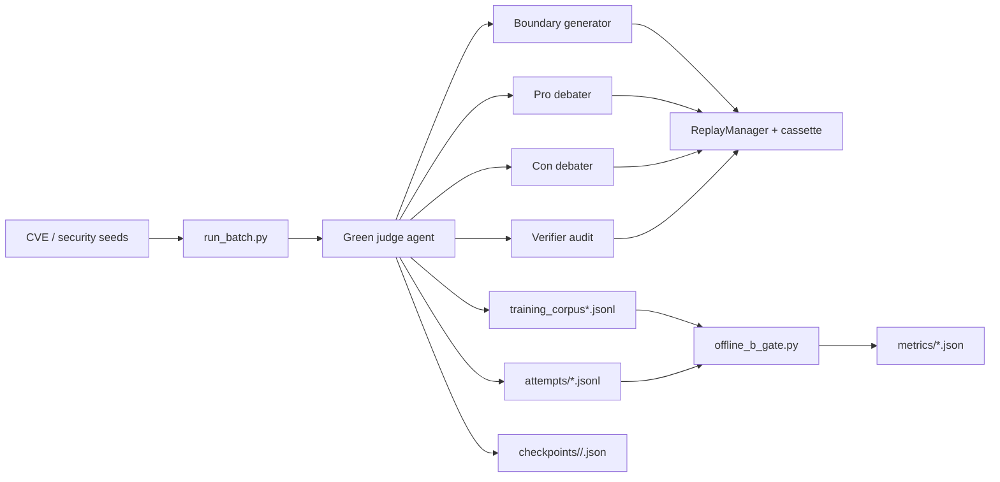

# silver-one

> Changing world values are inputs. Inputs are recorded. Recorded inputs are replayable. Replayable workflows are evolvable.

`silver-one` is an Agentbeats research project for generating auditable code-security reasoning data. Its long-term goal is to build the kind of grounded corpus needed to train safer security-reasoning models: models that learn from concrete evidence hooks, mechanism-level invariants, verifier feedback, and rejected failure cases instead of shallow vulnerable/safe labels.

The project is a continuation of the In-Varia metacognitive-control research direction and the Google DeepMind/Kaggle AGI hackathon work behind MCSB v2. That earlier work showed that models can look calibrated in static settings while failing to update beliefs correctly under adversarial code-security evidence. `silver-one` moves from measuring that failure mode toward producing better training data for it.

The main implemented scenario is **BARRED** (Boundary Adversarial Reasoning for Reproducible Evaluation and Dataset generation):
- a Green agent (`adk_debate_judge.py`) orchestrates debate rounds,
- two Purple agents (`debater.py`) argue opposite sides,
- an optional Verifier agent (`adk_debate_verifier.py`) audits groundedness,
- outputs are written as training corpus rows and audited with an offline B-gate.

## Why This Matters

LLM-generated security datasets and agent evaluations are easy to make and hard to trust. Small hidden changes in prompts, model sampling, timestamps, tool calls, or verifier behavior can change which rows enter a corpus. If those rows are later used for training, hidden errors become training signal.

`silver-one` treats changing values as recorded inputs so generated rows can be audited, replayed, resumed, and rejected when the evidence is weak. The goal is not to maximize synthetic data volume. The goal is to produce a deep reasoning corpus whose verdicts, anchors, mechanisms, verifier outcomes, model controls, rejected attempts, and run state are inspectable after the fact.

The intended downstream use is training and evaluating safer code-security reasoning models. In this repo, "safer" means evidence-grounded, less prone to unsupported vulnerability claims, more explicit about uncertainty and failure modes, and easier to audit when a generated row is wrong.

## Where This Is Headed

`silver-one` is building toward a SecurityDecisionGuard-style training loop: generate high-fidelity code-security examples, debate the boundary condition, verify the mechanism, reject unsupported labels, and preserve enough trace data for later audit.

The near-term artifact is a **Deep Reasoning Corpus** for code security. Each accepted row should teach more than a label. It should expose the evidence hooks, mechanism-level invariants, counterfactual boundary, verifier judgment, model controls, and failure cases that shaped the decision.

The longer-term objective is to train and evaluate safer security-reasoning models: models that reason from grounded evidence, update under adversarial evidence, avoid shallow vulnerability claims, and make their uncertainty and failure modes visible enough for humans to inspect.


## Who This Is For

- AI evaluation researchers building reproducible agent benchmarks.
- Security dataset builders who need grounded vulnerability examples and rejected counterexamples rather than unsupported labels.
- Model builders training code-security reasoning models from auditable synthetic data.
- Agent framework maintainers studying checkpoint/resume, replay, and verifier boundaries.
- Engineers comparing model behavior across local, cloud, and Kaggle benchmark providers.

## Current Status

`silver-one` is early-stage research infrastructure under active development. It does not yet have broad public adoption, stars, or package downloads. It does have a working local harness, deterministic replay machinery, checkpointed batch execution, verifier accounting, calibrated corpus gates, and concrete run metrics from repeated pilot batches.

Use it today as an experimental evaluation harness, not as a polished production package.

## What This Repo Contains

- Agent runtime primitives under `src/agentbeats`.
- A complete debate scenario under `scenarios/debate`.
- Determinism tooling (record/replay cassettes and run records).
- Batch and Kaggle runners for larger corpus generation.
- Offline quality gates for structural completeness, anchor grounding, verifier parse/pass rates, logic-error leakage, and token efficiency.

## Architecture At A Glance



For the fuller Mermaid breakdown and stress-test playbook, see `docs/ARCHITECTURE_MERMAID.md`.

## Reproducible Smoke Path

Start the BARRED stack:

```bash
./scenarios/debate/start_stack.sh
```

In a second terminal, run a clocked batch:

```bash
uv run python scenarios/debate/run_batch.py \
  --run-id pilot-v1-clocked \
  --seed 42 \
  --mode record \
  --clock-now 2026-05-31T16:06:00Z \
  --seeds scenarios/debate/cve_seeds_test.jsonl \
  --output training_corpus_clocked.jsonl \
  --attempts-out artifacts/attempts/pilot-v1-clocked.jsonl
```

Compute B-gate metrics:

```bash
uv run python scenarios/debate/offline_b_gate.py \
  --input training_corpus_clocked.jsonl \
  --attempts artifacts/attempts/pilot-v1-clocked.jsonl \
  --metrics-out artifacts/metrics/b_gate-pilot-v1-clocked.json
```

## Latest Calibrated Results

After predicate-quality calibration and logic-error gating, the clean calibrated runs showed stable quality with lower yield:

| Metric | Calibrated B | Calibrated C |
| :--- | ---: | ---: |
| B-gate pass | `true` | `true` |
| Accepted rows | `11` | `10` |
| Attempts | `30` | `31` |
| Predicate-quality fail rate | `0.0909` | `0.0870` |
| Accepted logic-error count | `0` | `0` |
| Verifier parse OK rate | `1.00` | `1.00` |
| Strict B2 fail rate | `0.1034` | `0.0645` |
| Mechanism grounding fail rate | `0.0333` | `0.0000` |
| Tokens / accepted row | `94,480` | `98,304` |

Interpretation: corpus cleanliness improved, placeholder predicates are rejected, verifier logic errors no longer leak into accepted rows, and the next optimization target is yield/token efficiency rather than predicate calibration.

## Artifact Hygiene

Generated corpora, cassettes, attempts, metrics, checkpoints, and local `.env` files are intentionally ignored by git. Keep committed changes focused on harness code, seed definitions, tests, docs, and reproducible commands. Run artifacts should be attached to reports or copied into docs only when they are intentionally curated.

## Architecture

### Core runtime (`src/agentbeats`)

- `run_scenario.py`: starts participant and green agents from scenario TOML, waits for readiness, optionally launches the client.
- `client_cli.py`: sends `assessment_request` payload to the green agent and streams updates/artifacts.
- `client.py`: A2A messaging helpers.
- `green_executor.py`: base green-agent execution wrapper.
- `models.py`: shared Pydantic request/result models.
- `replay.py`: deterministic run infrastructure (`RunRecord`, `LLMCassette`, `ReplayManager`).
- `structured_output.py`: robust structured-output parser/repair pipeline for JSON responses.

### Debate scenario (`scenarios/debate`)

- `adk_debate_judge.py`: primary BARRED green agent with orchestration, strict gates, and export logic.
- `debater.py`: participant debater agent.
- `adk_debate_verifier.py`: optional verifier used for mechanism/anchor audits.
- `data_generator.py`: boundary-sample generation and refinement for BARRED loops.
- `run_batch.py`: seed-driven batch execution against the running judge.
- `offline_b_gate.py`: offline quality gate and metrics computation over generated corpus.
- `scenario.toml`: minimal debate scenario.
- `barred_test.toml`: BARRED scenario including verifier participant.

## Installation

### Prerequisites

- Python `>=3.11`
- `uv`
- model provider access (for example Ollama local models or remote LiteLLM providers)

### Setup

```bash
git clone https://github.com/surfiniaburger/silver-one.git
cd silver-one
uv sync
cp sample.env .env
```

Configure API/provider environment variables in `.env` as needed.

## Quick Start

Run the default debate scenario:

```bash
uv run agentbeats-run scenarios/debate/scenario.toml
```

Run with logs:

```bash
PYTHONPATH=src uv run agentbeats-run scenarios/debate/scenario.toml --show-logs
```

Serve agents only (no client run):

```bash
uv run agentbeats-run scenarios/debate/scenario.toml --serve-only
```

### Model overrides

The scenario reads model choices from environment variables:

- `JUDGE_MODEL`
- `DEBATER_MODEL`
- `GENERATOR_MODEL`
- `VERIFIER_MODEL`
- `GEPA_MODEL` (used by seed-loader workflows)

### Sampling controls

Tracked LiteLLM calls read and record sampling controls from environment variables:

- `LLM_SAMPLING_PROFILE=ollama_gemma4`
- `LLM_TEMPERATURE`
- `LLM_TOP_P`
- `LLM_TOP_K`
- `LLM_MAX_TOKENS`

The `ollama_gemma4` profile applies Ollama's Gemma 4 sampling recommendation only to tracked models whose name contains `gemma4`:

```bash
temperature=1.0
top_p=0.95
top_k=64
```

These values are written into run records, attempt logs, corpus row metadata, and B-gate metrics so generation settings are treated as control variables rather than hidden confounders.

Example:

```bash
JUDGE_MODEL="ollama/qwen2.5-coder:7b" \
DEBATER_MODEL="ollama/qwen2.5-coder:7b" \
uv run agentbeats-run scenarios/debate/scenario.toml
```

## BARRED Workflow

### Option A: Start the full stack via helper script

```bash
# Terminal 1: Start full stack (judge + debaters + verifier)
./scenarios/debate/start_stack.sh
```

This script:
- kills stale listeners on ports `9009,9018,9019,9020`
- exports default model env vars if not already set
- launches `agentbeats-run scenarios/debate/barred_test.toml --serve-only`

### Option B: Start the full stack directly

```bash
uv run agentbeats-run scenarios/debate/barred_test.toml --serve-only
```

### 2) Run batch generation from seeds

```bash
uv run python scenarios/debate/run_batch.py \
  --seeds scenarios/debate/cve_seeds_50.jsonl \
  --output training_corpus.jsonl \
  --run-id pilot-v1 \
  --seed 42 \
  --mode record
```

### 3) Compute offline B-gate metrics

```bash
uv run python scenarios/debate/offline_b_gate.py \
  --input training_corpus.jsonl \
  --attempts artifacts/attempts/pilot-v1.jsonl \
  --metrics-out artifacts/metrics/b_gate.json
```

### Soft-check run (attempts + B metrics)

Use this exact flow when you want attempts-level soft checks captured and scored:

```bash
# Terminal 1: Start full stack (judge + debaters + verifier)
./scenarios/debate/start_stack.sh

# Re-run a record run to generate attempts with soft_checks

uv run python scenarios/debate/run_batch.py \
  --run-id pilot-v1-calibrated-e \
  --seed 42 \
  --mode replay \
  --clock-now 2026-06-07T12:09:00Z \
  --seeds scenarios/debate/cve_seeds_test.jsonl \
  --output training_corpus_calibrated_e.jsonl \
  --attempts-out artifacts/attempts/pilot-v1-calibrated-e.jsonl


# Compute B metrics + soft-check rates

./scripts/run_b_gate.sh \
  training_corpus_calibrated_e.jsonl \
  artifacts/attempts/pilot-v1-calibrated-e.jsonl \
  artifacts/metrics/b_gate-pilot-v1-calibrated-e.json
```

## Determinism and Replay

The project supports deterministic record/replay for model calls.

- **Record mode**: real provider calls are made, responses are cached.
- **Replay mode**: no cache miss is allowed; missing entries fail fast.

Key artifacts:

- `artifacts/cassettes/<run-id>.json`
- `artifacts/runs/<run-id>/<seed>.json`
- `artifacts/runs/<run-id>/batch_manifest.json`
- `artifacts/attempts/<run-id>.jsonl`
- `artifacts/checkpoints/<run-id>/<seed>.json`

Replay example:

```bash
uv run python scenarios/debate/run_batch.py \
  --run-id pilot-v1-calibrated-e \
  --seed 42 \
  --mode replay \
  --clock-now 2026-06-07T12:29:00Z \
  --seeds scenarios/debate/cve_seeds_test.jsonl \
  --output training_corpus_calibrated_e.jsonl \
  --attempts-out artifacts/attempts/pilot-v1-calibrated-e.jsonl
```

Resume a partially completed batch from per-seed workflow checkpoints, (remember to crank the clock before resuming):

```bash
uv run python scenarios/debate/run_batch.py \
  --run-id pilot-v1-calibrated-e \
  --seed 42 \
  --mode record \
  --resume \
  --clock-now 2026-06-07T13:08:00Z \
  --checkpoint-dir artifacts/checkpoints/pilot-v1-calibrated-e \
  --seeds scenarios/debate/cve_seeds_test.jsonl \
  --output training_corpus_calibrated_e.jsonl \
  --attempts-out artifacts/attempts/pilot-v1-calibrated-e.jsonl  
```

Checkpoints preserve the latest durable phase for a seed, including generated sample, debate transcript, judge output, strict-gate state, verifier state, and run controls. Resume validates logical controls, not wall-clock equality: it fails if model choices, sampling config, seed, predicate, target verdict, target dimension, cassette path, or input hash drift, but `clock_now` is recorded as audit metadata rather than used as a strict resume key. Each checkpoint also stores `updated_at`, the actual checkpoint write time.

Batch runs use a base seed plus item index (`item_seed = base_seed + zero_based_index`) and write one run record per item seed. The batch manifest records this seed schedule, per-seed checkpoint paths, per-seed run-record paths, and the injected `clock_now` value used for run records and checkpoints. Set `RUN_CLOCK_NOW` or pass `--clock-now` to freeze artifact timestamps for deterministic replay audits.

## Kaggle Runner

Use the automation helper:

```bash
uv run python kaggle_notebooks/run_barred_kaggle.py \
  --scenario scenarios/debate/barred_test.toml \
  --run-id kaggle-pilot \
  --mode record \
  --seed 42 \
  --seeds scenarios/debate/cve_seeds_50.jsonl \
  --output /kaggle/working/training_corpus.jsonl \
  --attempts-out /kaggle/working/attempts.jsonl \
  --metrics-out /kaggle/working/b_gate.json
```

## Testing

Scenario-level tests currently live under `scenarios/debate`.

```bash
uv run python scenarios/debate/test_structured_output.py
uv run python scenarios/debate/test_offline_b_gate.py
```

If you have `pytest` installed in your environment:

```bash
uv run pytest -q scenarios/debate
```

## Repository Layout

```text
silver-one/
├─ src/agentbeats/
│  ├─ run_scenario.py
│  ├─ client_cli.py
│  ├─ replay.py
│  ├─ structured_output.py
│  └─ ...
├─ scenarios/debate/
│  ├─ adk_debate_judge.py
│  ├─ adk_debate_verifier.py
│  ├─ debater.py
│  ├─ data_generator.py
│  ├─ run_batch.py
│  ├─ offline_b_gate.py
│  ├─ scenario.toml
│  └─ barred_test.toml
├─ kaggle_notebooks/
│  └─ run_barred_kaggle.py
├─ sample.env
├─ pyproject.toml
└─ README.md
```

## Contributing

- Keep changes deterministic-friendly (record/replay aware).
- Update scenario docs if you change config fields in TOML or expected output schema.
- Prefer robust structured JSON parsing via `src/agentbeats/structured_output.py`.

See `AGENT.md` for repository-specific coding and review instructions.

## License

MIT License. See `LICENSE`.
