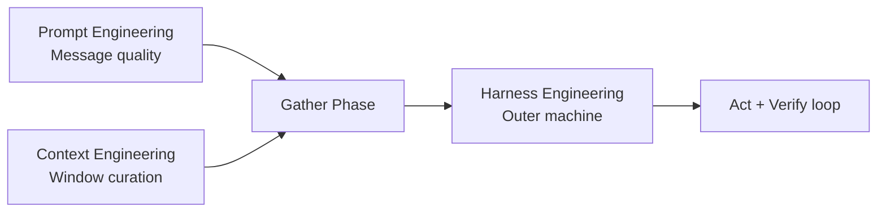
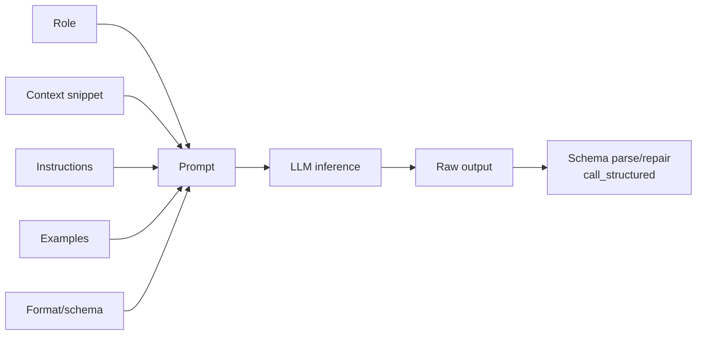
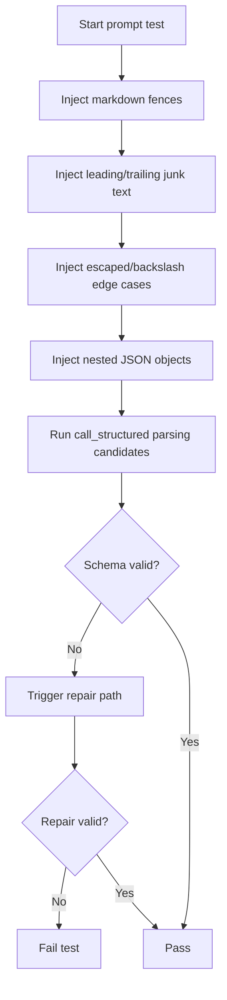
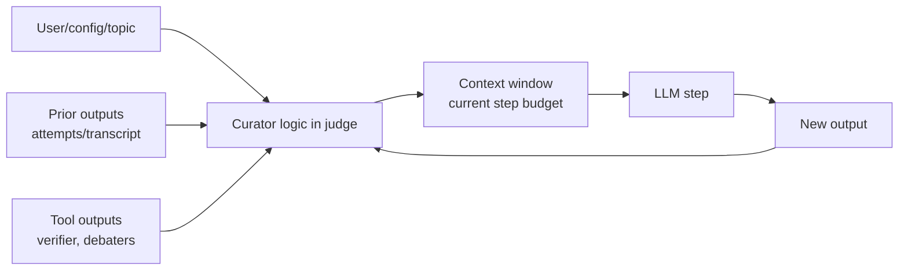
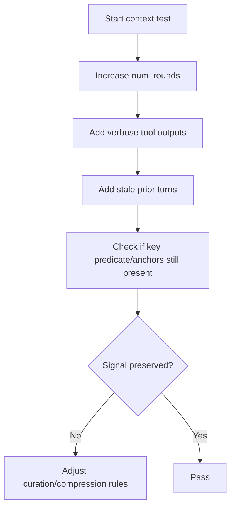
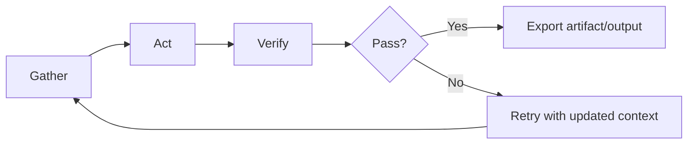
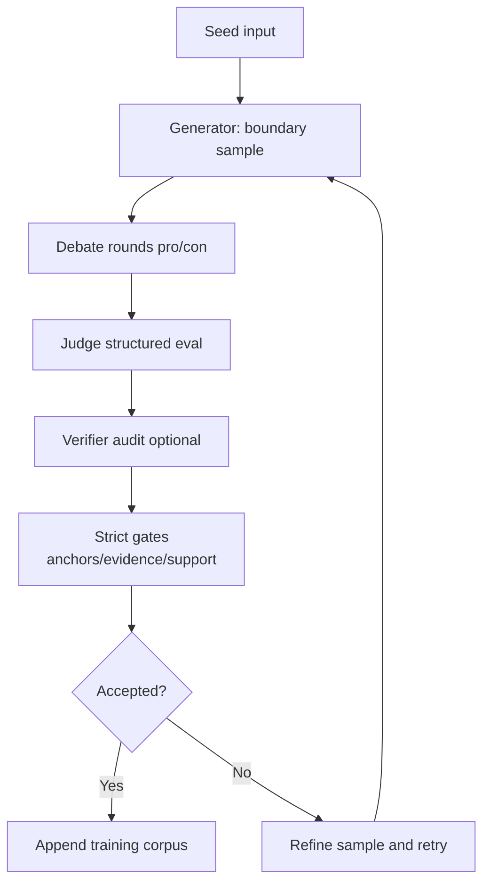
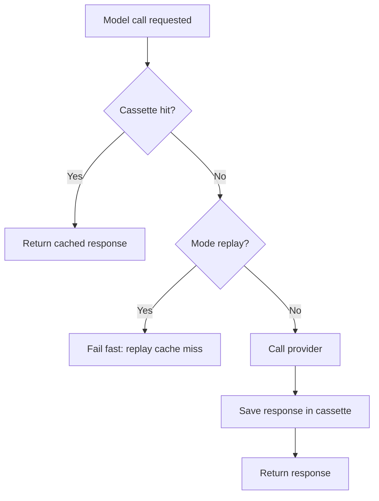
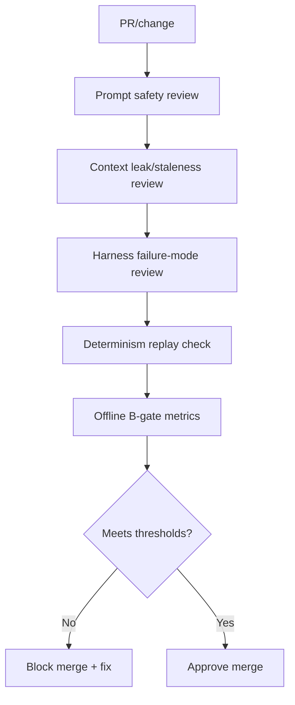
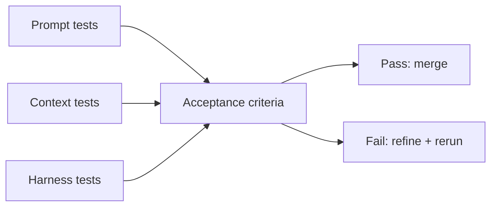

# silver-one Architecture: Prompt, Context, Harness

This document maps the Prompt/Context/Harness model to the actual `silver-one` implementation and provides stress-test and security review flows.

## 1) Concept map in this repo

## 2) Prompt engineering (unit of work: one input)

Repo mapping:
- Prompt assembly and schema constraints: `src/agentbeats/structured_output.py`
- Judge prompt and role constraints: `scenarios/debate/adk_debate_judge.py`
- Verifier prompt and audit constraints: `scenarios/debate/adk_debate_verifier.py`
- Generator prompts for boundary/refinement: `scenarios/debate/data_generator.py`

### Prompt stress tests

## 3) Context engineering (unit of work: what stays in the window each step)

Repo mapping:
- Input curation decisions in runtime flow: `scenarios/debate/adk_debate_judge.py`
- Working set evolution across rounds: `run_eval` loop in judge
- Attempt-level telemetry for later curation audits: `artifacts/attempts/*.jsonl`

### Context stress tests

## 4) Harness engineering (unit of work: the machine)

Repo mapping:
- Scenario runner/orchestration: `src/agentbeats/run_scenario.py`
- Client/event streaming: `src/agentbeats/client_cli.py`, `src/agentbeats/client.py`
- Determinism and replay: `src/agentbeats/replay.py`
- Full BARRED judge loop and gating: `scenarios/debate/adk_debate_judge.py`
- Batch and offline gates: `scenarios/debate/run_batch.py`, `scenarios/debate/offline_b_gate.py`

## 5) Deterministic record/replay flow

## 6) Security and quality review flow

### Security critique checklist

- Prompt layer:
  - Are system instructions robust against untrusted content injection?
  - Are output formats schema-constrained everywhere they should be?
  - Are parser helpers centralized (`structured_output.py`) with no duplicate drift?

- Context layer:
  - Can stale turns/tool noise bury critical predicate/anchor info?
  - Are we recording enough attempt metadata to audit context failures?
  - Do retry loops preserve relevant evidence and drop irrelevant noise?

- Harness layer:
  - Does every critical model call go through deterministic replay paths where required?
  - Do replay cache misses fail loudly?
  - Are verify gates strong enough to prevent low-groundedness outputs from being accepted?

## 7) Suggested stress-test matrix

- Prompt tests:
  - malformed JSON wrappers, nested objects, bad escapes, long preambles.
- Context tests:
  - long transcripts, noisy tool outputs, repeated retries, contradictory prior turns.
- Harness tests:
  - replay mode with missing cassette entries, verifier parse failures, strict gate rejections.

## 8) How to use this doc

1. Pick one layer (Prompt, Context, Harness).
2. Run the stress tests for only that layer.
3. Record failures in attempts/metrics.
4. Patch only the mapped files for that layer.
5. Re-run `offline_b_gate.py` and compare metrics.
