# CI Quality Loop

Silver-One's CI loop combines three quality signals into one pull request
report:

- Code Review: local or configured LLM review of changed Python code units
- Farley Test Quality: LLM evaluation of changed tests plus baseline comparison
- API Compatibility: deterministic public API compatibility checks

The current goal is not to make the model autonomous. The goal is to wrap local
LLM review in a deterministic harness that can validate, repair, retry, report,
and measure failures without aborting the workflow.

```mermaid
flowchart TD
    A["Pull request opened or updated"] --> B["GitHub Actions: Farley Score CI"]

    B --> C1["Checkout repository<br/>fetch-depth: 0"]
    C1 --> C2["Set up Python"]
    C2 --> C3["Install dependencies"]

    C3 --> D1["Code Review job"]
    C3 --> E1["Farley Eval job"]

    D1 --> D2["Extract changed Python units<br/>against origin/main"]
    D2 --> D3["Estimate token budget<br/>and filter units"]
    D3 --> D4["Call local or configured LLM<br/>for each changed unit"]
    D4 --> D5["Structured output harness"]

    D5 --> D6{"Valid JSON?"}
    D6 -- "No" --> D7["Attempt JSON repair"]
    D7 --> D8{"Repair valid?"}
    D8 -- "No" --> D9["Retry with schema-aware feedback<br/>bounded retries"]
    D8 -- "Yes" --> D10["Validate CodeReviewBreakdown"]
    D6 -- "Yes" --> D10
    D9 --> D10

    D10 --> D11{"Schema valid?"}
    D11 -- "No, retries remain" --> D9
    D11 -- "No, retries exhausted" --> D12["Record recoverable evaluation failure<br/>review = null"]
    D11 -- "Yes" --> D13["Build UnitReviewArtifact<br/>review + validation + raw_response"]

    D12 --> D14["Write code review cassette"]
    D13 --> D14
    D14 --> D15["Build validation summary<br/>valid / repaired / normalized / invalid"]
    D15 --> D16["Write token spend metrics"]
    D16 --> D17["Persist code review artifacts"]

    E1 --> E2["Extract changed tests<br/>against origin/main"]
    E2 --> E3["Evaluate test quality with LLM"]
    E3 --> E4["Validate Farley structured output"]
    E4 --> E5["Write Farley PR cassette"]
    E5 --> E6["Load Farley baseline cassette"]
    E6 --> E7{"Baseline available?"}
    E7 -- "Yes" --> E8["Build virtual suite<br/>baseline + PR changes"]
    E8 --> E9["Compute Farley PR score<br/>and delta"]
    E7 -- "No" --> E10["Record baseline state<br/>FIRST_RUN / MISSING / CORRUPTED"]
    E10 --> E9

    D17 --> F1["Unified Report job"]
    E9 --> F1

    F1 --> F2["Load Code Review cassette"]
    F2 --> F3["Load Farley cassette and baseline state"]
    F3 --> F4["Run API compatibility check<br/>write compatibility_results.json"]
    F4 --> F5["Load API compatibility results"]
    F5 --> F6["Normalize code review units"]

    F6 --> F7{"Review unit type"}
    F7 -- "Current UnitReviewArtifact" --> F8["Use review payload"]
    F7 -- "Legacy direct review payload" --> F9["Wrap as UnitReviewArtifact"]
    F7 -- "Recoverable failure" --> F10["Show as N/A<br/>exclude from CQI"]

    F8 --> F11["Calculate CQI"]
    F9 --> F11
    F10 --> F12["Collect structured-output telemetry"]

    F11 --> F13{"Invalid CQI?"}
    F13 -- "Yes" --> F14["Fail Code Review metric"]
    F13 -- "No" --> F15["Average valid CQI units"]

    F12 --> F15
    F14 --> F16["Combine quality domains"]
    F15 --> F16
    E9 --> F16
    F5 --> F16

    F16 --> F17["Metrics overview<br/>CQI + Farley + API Compatibility"]
    F17 --> F18["Detailed Code Review findings"]
    F18 --> F19["Farley baseline and regression details"]
    F19 --> F20["API compatibility details"]
    F20 --> F21["Generate report.md"]

    F21 --> F22{"Unified verdict"}
    F22 -- "PASS" --> F23["Post PR comment<br/>GitHub check passes"]
    F22 -- "FAIL" --> F24["Post PR comment<br/>GitHub check fails"]

    F23 --> G["Developer reviews report"]
    F24 --> G
    G --> H["Next commit or merge decision"]
```

## Current Semantics

The API compatibility check runs as a preceding step in the `unified-report`
job and writes `compatibility_results.json`; `scripts/unified_compare.py` loads
that file when compiling the final report.

The code review path separates three concerns:

- Reviewer quality: CQI, severity, summary, and structured findings
- Harness reliability: JSON repair, schema retries, recoverable failures, and
  validation telemetry
- CI policy: whether the unified report should pass or fail the pull request

Recoverable evaluation failures are visible in the report, but they are not
treated as invalid CQI reviews. They mean the harness could not obtain a valid
review after repair and retry attempts. Invalid CQI means the model produced a
review-like object that failed the scoring contract.

## Near-Term Gaps

The current report is reliable enough to gate CI, but the human-facing review
experience still needs work:

- PR-level summaries are not yet generated as a first-class report section.
- Empty per-unit summaries can still render as blank cells.
- GitHub suggestion blocks are not emitted yet.
- Patch suggestions are not part of the structured schema.

Those are product-experience improvements. They should build on the current
contract rather than weakening the validation harness.

## Related Documents

- [`STRUCTURED_REVIEW_CONTRACT.md`](./STRUCTURED_REVIEW_CONTRACT.md)
- [`CODE_REVIEW_CI_PLAN.md`](./CODE_REVIEW_CI_PLAN.md)
- [`EVALUATION_ROADMAP.md`](./EVALUATION_ROADMAP.md)
