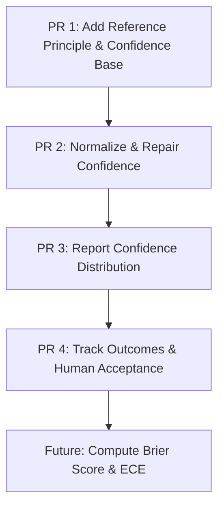

# Silver-One Metacog Calibration: Confidence Roadmap (PR 2 to PR 4)

This document outlines the implementation plan and detailed walkthrough for extending Silver-One's code review framework with structured reviewer confidence. It establishes a pathway to evaluate how reliable the model's confidence estimates are when predicting whether a finding is real and actionable.

---

## Roadmap Overview



- **PR 1 (Completed)**: Added `reference_principle` to `EngineeringFinding`, ensuring backward-compatible parsing and schema validation.
- **PR 2 (Completed)**: Transitioned the `confidence` field in `EngineeringFinding` to a structured categorical type (`"LOW" | "MEDIUM" | "HIGH"`), and implemented robust normalization/repair logic.
- **PR 3**: Aggregate and report the distribution of finding confidence levels in the unified quality report.
- **PR 4**: Map finding confidence to human developer outcomes (acceptance/rejection) and compute empirical calibration metrics.

---

## PR 2: Normalize and Repair Confidence Values

### Goal
Define confidence as a categorical label (`Literal["LOW", "MEDIUM", "HIGH"]`) and implement validators to clean up numeric values, non-standard strings, and null inputs.

### Current Status

Implemented in `scripts/finding_schema.py` and reused by
`scripts/unified_compare.py` during report rendering. The parser accepts:

- categorical labels: `LOW`, `MEDIUM`, `HIGH`
- synonyms such as `certain`, `moderate`, `weak`
- numeric scores on 0.0-1.0, 1-5, and percentage-like scales
- percentage strings such as `85%`
- fraction strings such as `4/5`
- malformed or missing values, which fall back to `MEDIUM`

Validation telemetry records missing, boolean, numeric, non-categorical string,
and invalid-type confidence values as repaired fields. Categorical values that
only differ by surrounding whitespace or case are normalized rather than treated
as invalid review output.

### 1. Schema Modifications

We update the `confidence` field definition and add validators in [finding_schema.py](file:///Users/surfiniaburger/Desktop/modular-metacog-swarm-v3/agent_training/silver-one/scripts/finding_schema.py):

```python
# scripts/finding_schema.py

class EngineeringFinding(BaseModel):
    ...
    confidence: Literal["LOW", "MEDIUM", "HIGH"] = Field(
        "MEDIUM", 
        description="Actionable reviewer confidence level."
    )

    @field_validator("confidence", mode="before")
    @classmethod
    def validate_confidence(cls, v):
        if v is None:
            return "MEDIUM"
        
        # 1. Handle numeric inputs (e.g. 1..5 scale or 0.0..1.0 float)
        if isinstance(v, (int, float)) and not isinstance(v, bool):
            if v > 1.0:
                v = v / 100.0 if v > 5.0 else v / 5.0  # Scale percentages or 1-5 ratings
            
            if v >= 0.8:
                return "HIGH"
            elif v >= 0.4:
                return "MEDIUM"
            else:
                return "LOW"
                
        # 2. Handle string inputs (case-insensitive mapping & synonyms)
        if isinstance(v, str):
            val_clean = v.strip().upper()
            if val_clean in {"HIGH", "CERTAIN", "CRITICAL", "5", "4"}:
                return "HIGH"
            elif val_clean in {"MEDIUM", "MODERATE", "NORMAL", "3"}:
                return "MEDIUM"
            elif val_clean in {"LOW", "WEAK", "POOR", "2", "1"}:
                return "LOW"
            
            # Fallback float-string parsing
            try:
                numeric_val = float(val_clean)
                if numeric_val > 1.0:
                    numeric_val = numeric_val / 100.0 if numeric_val > 5.0 else numeric_val / 5.0
                if numeric_val >= 0.8:
                    return "HIGH"
                elif numeric_val >= 0.4:
                    return "MEDIUM"
                else:
                    return "LOW"
            except ValueError:
                pass
                
        return "MEDIUM"
```

### 2. Validation Telemetry Integration

We update the validation summary logic to log confidence normalization or repair events in `scripts/finding_schema.py`:

```python
# scripts/finding_schema.py

def _validate_finding_confidence(idx: int, raw_find: Dict[str, Any], parsed_find: Any, fields: List[FieldValidation]) -> None:
    raw_conf = raw_find.get("confidence")
    parsed_conf = getattr(parsed_find, "confidence", "MEDIUM")
    
    if raw_conf != parsed_conf:
        is_repaired = False
        repair_type = None
        repair_reason = None
        
        if raw_conf is None:
            is_repaired = True
            repair_type = "missing_default"
            repair_reason = "missing confidence repaired to MEDIUM"
        elif isinstance(raw_conf, (int, float)) or (isinstance(raw_conf, str) and raw_conf.upper() not in {"LOW", "MEDIUM", "HIGH"}):
            is_repaired = True
            repair_type = "type_coercion"
            repair_reason = f"coerced raw confidence value '{raw_conf}' to '{parsed_conf}'"
            
        status = "REPAIRED" if is_repaired else "NORMALIZED"
        fields.append(FieldValidation(
            field_name=f"findings[{idx}].confidence",
            status=status,
            raw_value=raw_conf,
            repaired_value=parsed_conf,
            repair_type=repair_type,
            repair_reason=repair_reason
        ))
```

### 3. Verification Plan
- Write tests in `tests/test_code_review.py` passing:
  - Numeric floats (`0.95` -> `"HIGH"`, `0.15` -> `"LOW"`)
  - Numeric ratings (`5` -> `"HIGH"`, `1` -> `"LOW"`)
  - Synonyms (`"certain"` -> `"HIGH"`, `"moderate"` -> `"MEDIUM"`)
  - Null/Missing fields -> `"MEDIUM"` with status `REPAIRED`
- Ensure no regressions with legacy float-based cassette files (which get parsed and normalized gracefully).

---

## PR 3: Report Confidence Distribution

### Goal
Expose finding confidence statistics in the Unified Quality Report so that maintainers can easily inspect reviewer assertiveness.

### 1. Aggregating Confidence Distributions

Modify [unified_compare.py](file:///Users/surfiniaburger/Desktop/modular-metacog-swarm-v3/agent_training/silver-one/scripts/unified_compare.py) to parse and count confidence categories across all findings:

```python
# scripts/unified_compare.py

def calculate_confidence_distribution(cr_units: List[Dict[str, Any]]) -> Dict[str, int]:
    counts = {"HIGH": 0, "MEDIUM": 0, "LOW": 0}
    for unit in cr_units:
        if is_recoverable_review_failure(unit):
            continue
        review = unit.get("review") or {}
        findings = review.get("findings") or []
        for finding in findings:
            if not isinstance(finding, dict):
                continue
            conf = finding.get("confidence", "MEDIUM")
            if conf in counts:
                counts[conf] += 1
            else:
                # Handle legacy float values from un-migrated cassettes
                try:
                    val = float(conf)
                    if val >= 0.8:
                        counts["HIGH"] += 1
                    elif val >= 0.4:
                        counts["MEDIUM"] += 1
                    else:
                        counts["LOW"] += 1
                except (ValueError, TypeError):
                    counts["MEDIUM"] += 1
    return counts
```

### 2. Rendering in the Unified Report

Add the distribution summary directly to the markdown template in `scripts/unified_compare.py`:

```python
# scripts/unified_compare.py

def _write_metrics_overview(
    f,
    cr_data: Dict[str, Any],
    farley_data: Dict[str, Any],
    compat_data: Dict[str, Any],
) -> None:
    f.write("## Metrics Overview\n\n")
    
    # 1. Main metrics table
    f.write("| Lane | What It Measures | Metric / Score | Status |\n")
    f.write("|---|---|---|---|\n")
    ...
    
    # 2. Confidence Distribution Section
    cr_units = cr_data.get("units") or []
    dist = calculate_confidence_distribution(cr_units)
    total_findings = sum(dist.values())
    
    f.write("### Finding Confidence Distribution\n\n")
    if total_findings == 0:
        f.write("No structured engineering findings reported in this run.\n\n")
    else:
        f.write(f"- **HIGH Confidence**: {dist['HIGH']} finding(s) ({dist['HIGH']/total_findings:.1%})\n")
        f.write(f"- **MEDIUM Confidence**: {dist['MEDIUM']} finding(s) ({dist['MEDIUM']/total_findings:.1%})\n")
        f.write(f"- **LOW Confidence**: {dist['LOW']} finding(s) ({dist['LOW']/total_findings:.1%})\n\n")
```

---

## PR 4: Track Outcomes and Human Acceptance

### Goal
Provide a simple interface to log human reviewer feedback (Accept / Reject) for each structured finding, laying the groundwork for Brier Score calibration.

### 1. Developer Outcome Data Structure
We define a schema for the developer feedback file, stored at `artifacts/developer_outcomes.json`:

```json
{
  "outcomes": [
    {
      "finding_id": "scripts/finding_schema.py:Line 83:Confidence cannot be None",
      "confidence": "HIGH",
      "outcome": "ACCEPTED",
      "developer_notes": "Good catch, added exception handling."
    },
    {
      "finding_id": "tests/test_code_review.py:Line 560:Assertion error check",
      "confidence": "LOW",
      "outcome": "REJECTED",
      "developer_notes": "False positive, test was already configured correctly."
    }
  ]
}
```

### 2. Calibration Metric Calculation
Create a calibration tool `scripts/calibration_evaluator.py` that computes statistics based on the logged outcomes:

```python
# scripts/calibration_evaluator.py
import json
from pathlib import Path
from statistics import mean

def compute_calibration_metrics(outcomes_path: Path):
    if not outcomes_path.exists():
        print("No outcome data found.")
        return
        
    with open(outcomes_path, "r") as f:
        data = json.load(f)
        
    outcomes = data.get("outcomes", [])
    
    # Track acceptance rates by confidence bin
    bins = {"HIGH": [], "MEDIUM": [], "LOW": []}
    for item in outcomes:
        conf = item.get("confidence", "MEDIUM")
        status = 1.0 if item.get("outcome") == "ACCEPTED" else 0.0
        if conf in bins:
            bins[conf].append(status)
            
    print("### Empirical Calibration Metrics")
    for conf, decisions in bins.items():
        rate = mean(decisions) if decisions else 0.0
        print(f"- {conf} Acceptance Rate: {rate:.1%} ({len(decisions)} sample(s))")
        
    # Calculate Brier Score (mapping HIGH=0.9, MEDIUM=0.5, LOW=0.2)
    prob_map = {"HIGH": 0.9, "MEDIUM": 0.5, "LOW": 0.2}
    squared_errors = []
    for item in outcomes:
        p = prob_map.get(item.get("confidence"), 0.5)
        o = 1.0 if item.get("outcome") == "ACCEPTED" else 0.0
        squared_errors.append((p - o) ** 2)
        
    brier_score = mean(squared_errors) if squared_errors else 0.0
    print(f"- Brier Score (lower is better): {brier_score:.4f}")
```

### 3. Calibration Goals
Once outcome collection is active, the team can analyze:
- **Overconfidence**: Are `HIGH` confidence findings frequently rejected?
- **Underconfidence**: Are `LOW` confidence findings highly accurate but understated?
- **Refining Prompts**: Adjust model system instructions to improve Brier Score closer to `0.0`.
