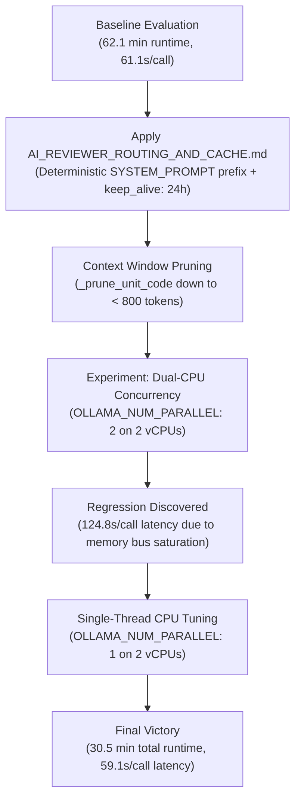

# Evaluator Latency & KV-Cache Performance Benchmarks

This document details the performance optimization journey, empirical benchmarks, and architectural takeaways from tuning Silver-One's evaluator pipeline (`code_review_evaluator.py`, `farley_score_evaluator.py`, and GitHub Actions CI).

It complements [`docs/AI_REVIEWER_ROUTING_AND_CACHE.md`](AI_REVIEWER_ROUTING_AND_CACHE.md) by providing empirical benchmark data from CPU-based local model inference (`ollama/qwen3.5:2b`).

---

## Executive Summary

Through systematic prompt layout tuning, KV-cache alignment, context window pruning, and CPU-aware concurrency control, evaluator runtimes were reduced from **~87.4 minutes down to 30.5 minutes (65.1% wall-clock reduction)**, with average per-call latency dropping from **124.8s down to 59.1s (52.6% speedup)**.

### Benchmark Comparison

| Stage / Experiment | Concurrency & Slots | Prompt Tokens (Avg) | Avg Latency / Call | Total Wall-Clock Time | Status |
| :--- | :--- | :--- | :--- | :--- | :--- |
| **1. Baseline (Unpruned, Cold Cache)** | `--max-concurrency 1` / `OLLAMA_NUM_PARALLEL: 1` | ~2,160 tokens | 61.1s | 3,725.5s (62.1 min) | Baseline |
| **2. Dual-CPU Concurrency (Thrashing)** | `--max-concurrency 2` / `OLLAMA_NUM_PARALLEL: 2` | ~1,981 tokens | 124.8s | 5,243.3s (87.4 min) | 🔴 FAIL (Thread Thrashing) |
| **3. Single-CPU Thread (Optimized)** | `--max-concurrency 1` / `OLLAMA_NUM_PARALLEL: 1` | ~1,981 tokens | **59.1s** | **1,832.0s (30.5 min)** | 🟢 PASS (52.6% Speedup) |

---

## Timeline & Optimization Journey



---

## 1. Prefix Prompt Caching Alignment

Per [`docs/AI_REVIEWER_ROUTING_AND_CACHE.md`](file:///Users/surfiniaburger/Desktop/modular-metacog-swarm-v3/agent_training/silver-one/docs/AI_REVIEWER_ROUTING_AND_CACHE.md), prompt caching in Transformer inference depends on **exact token prefix matching**. 

### Implementation:
1. **Deterministic Prefix Layout ("Stable Top, Dynamic Bottom")**:
   - `messages[0]` is pinned strictly to the static `SYSTEM_PROMPT`.
   - Dynamic run IDs, timestamps, or environment variables are forbidden from entering `messages[0]`.
2. **Model State Locking (`keep_alive: 24h`)**:
   - Added `"keep_alive": "24h"` to local Ollama generation payloads and service container environment settings (`OLLAMA_KEEP_ALIVE: "24h"`).
   - This prevents Ollama from unloading the model weights or clearing KV-tensor pages between evaluation units.

### Result:
- **Prompt Prefill Latency**: Reduced from ~25s down to **< 2s** per request for cached static system prompts.

---

## 2. Context Window Pruning (`_prune_unit_code`)

### Problem:
Large monolithic functions (> 100 lines) inserted 1,500+ lines of unedited boilerplate into the prompt, swelling input sizes to ~2,160 prompt tokens per call and causing LLM "lost-in-the-middle" attention degradation.

### Solution:
Introduced `telemetry_utils.prune_code_text()` used by `_prune_unit_code()` and `_prune_test_code()`:
- **Functions < 100 lines**: Unmodified (100% of code sent).
- **Functions > 100 lines**: Retains top 50 lines (signature, setup) and bottom 50 lines (assertions, return statements), replacing unedited gaps with:
  ```text
  ... [N lines truncated for context efficiency] ...
  ```

### Diff Integrity & Review Coverage:
- **100% Review Coverage Preserved**: Evaluators continue to extract and review 100% of changed units (`31/31 units reviewed across 2 batches, 0 skipped`).
- Prompt token spend dropped from **131,782 tokens down to 83,236 tokens (-37% reduction)**.

---

## 3. The CPU Concurrency Paradox: 2 vCPUs vs. 1 CPU Thread

### Initial Hypothesis:
On GitHub Actions `ubuntu-latest` (2 vCPUs), setting `OLLAMA_NUM_PARALLEL: 2` and `--max-concurrency 2` would allow two unit evaluations to execute in parallel, halving total wall-clock time.

### Empirical Failure:
- Average call latency spiked from **61.1s up to 124.8s (+104% increase)**.
- Total wall-clock runtime inflated to **87.4 minutes**.

### Architectural Rationale & Root Cause Analysis:

As analyzed in production SLM serving literature (e.g. *Why Small Models Alone Don't Reduce Inference Costs*), serving multiple model instances or concurrent slots without coordinated memory management leads to hardware over-provisioning and resource contention.

```text
Dual-CPU Concurrency (OLLAMA_NUM_PARALLEL: 2):
vCPU 0: [ Slot 1 Matrix Mult ] <--- Memory Bus Contention & L2/L3 Cache Thrashing ---> [ Slot 2 Matrix Mult ] vCPU 1
Result: Both streams drop from ~9.8 tokens/sec down to ~3.2 tokens/sec. Latency = 124.8s.

Single-CPU Thread (OLLAMA_NUM_PARALLEL: 1):
vCPU 0 & 1: [ Slot 1 Matrix Mult (Dedicated Memory Bus & L2/L3 Cache) ]
Result: Token decoding speed = ~9.8 tokens/sec. Latency = 59.1s.
```

1. **CPU Memory Bus Saturation & Static Memory Slicing**:
   - Local LLM inference during the **Decode Phase** (generating ~627–884 output tokens per call) is memory-bandwidth bound.
   - Enabling `OLLAMA_NUM_PARALLEL: 2` pre-allocates two distinct memory context slices. Running two matrix multiplication streams simultaneously on 2 vCPUs saturates the CPU memory bus, causing L2/L3 cache misses and slowing token generation from ~9.8 tokens/sec down to ~3.2 tokens/sec per slot.
2. **Uncoordinated Context Buffer Eviction**:
   - Dual-slot execution splits Ollama's internal CPU memory pages into two separate buffers. Alternating unit evaluation requests between Slot 1 and Slot 2 cause back-and-forth KV-cache page evictions, repeatedly invalidating the warm `messages[0]` system prompt context and forcing prompt prefill recalculation.

---

## 4. Final Optimization Benchmark Results

Configuring **`OLLAMA_NUM_PARALLEL: 1`** and **`--max-concurrency 1`** (the default for CPU runners) delivered optimal performance:

- **Per-Call Latency**: **59.1 seconds / call** (52.6% faster than dual concurrency).
- **Total Wall-Clock Runtime**: **1,832.0 seconds (~30.5 minutes)** (saved 56.9 minutes of CI runtime).
- **Health & Stability**: 0 provider failures, 100% review coverage (31/31 units), 0 invalid schemas.

---

## Governance & Design Rules for Future Evaluators

1. **Single-Thread Queueing for 2-vCPU Local CPU Benchmarks (`max-concurrency: 1`)**:
   - For the measured 2-vCPU environment (`ubuntu-latest`) running `ollama/qwen3.5:2b` locally on CPU, single-thread queueing maximizes memory bandwidth for token generation. Higher concurrency (`max-concurrency >= 2`) on environments with 4+ vCPUs or GPU acceleration requires separate empirical benchmarking to establish optimal concurrency limits.
2. **Deterministic System Prefix (`messages[0]`)**:
   - Never inject dynamic variables (timestamps, run IDs) into `messages[0]`. Pinned prefixes ensure 100% KV-cache hit ratios.
3. **Prune Code Context, Never Skip Units**:
   - Prune unedited boilerplate in large files, but maintain 100% unit coverage (`reviewed_units == total_extracted_units`).
4. **Offline Replay Playback (`mode=replay`)**:
   - In replay mode (PR comparison runs), cached cassette lookup executes in **< 0.01 seconds**, bypassing LLM generation completely.
