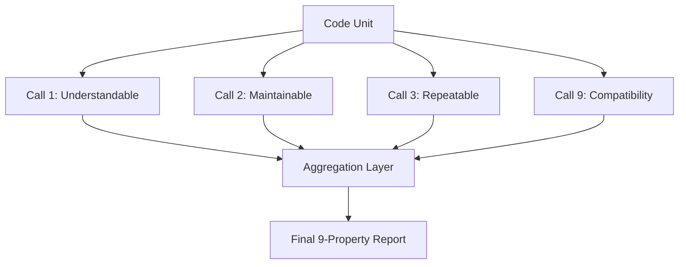

# Proposal: Prompt Engineering Architecture Upgrade

This document outlines a proposal to restructure and improve the LLM prompt architecture within our CI/CD code quality pipelines (specifically the **Code Review Evaluator** and **Farley Test Evaluator**). It integrates Anthropic's **Anatomy of a Claude Prompt** design patterns and proposes a 9th Farley evaluation dimension: **Compatibility**.

---

## 1. Key Shortcomings of the Current Prompting Model

Our current prompting model (implemented in `farley_score_evaluator.py` and `code_review_evaluator.py`) is structured as a **single-turn, monolithic query**. It requests a Pydantic-structured evaluation of 6 to 8 complex, independent properties simultaneously.

### A. Attention and Nuance Dilution (The "Monolithic" Problem)
When an LLM is asked to critique code on Readability, Maintainability, Correctness, Complexity, Security, and Test Coverage all at once:
* The model's context attention is spread thin.
* Nuanced, edge-case bugs (e.g., resource leaks, platform compatibility issues) are often overlooked because the model spends most of its generation/thinking budget summarizing general quality or readability.

### B. Missing Claude Prompt Best Practices
Our current system prompts lack structural anchors. To maximize reasoning and output quality (especially with modern Claude or Gemini models), we should adopt:
* **XML wrapping** for file contents, context, and schemas.
* **Separated reasoning (`<thinking>` tags)** before generating the final JSON response.
* **Clear example pairs** to seed what a "good" vs. "critical" review looks like.

### C. The Blind Spot: Platform Compatibility
Our current evaluations failed to flag compatibility issues (such as hardcoded path separators `\` or `/` that fail when transitioning between Windows CI agents and macOS local development). We need a dedicated evaluation dimension to catch OS, environment, and library compatibility bugs.

---

## 2. Introducing the 9th Farley Dimension: Compatibility

We propose adding **Compatibility** as the 9th metric in the Farley Test Evaluator (and a parallel check in the Code Review Evaluator). 

### Definition
A test or code unit is **Compatible** if it executes reliably across different operating systems (Windows, macOS, Linux), hardware architectures, and runtime environments without local machine state side effects.

### Critical Checks for the Compatibility Metric
1. **OS File Path Handling**: Use of `Path` objects (`pathlib`) instead of hardcoded string splits or platform-specific separators (`/` or `\`).
2. **Environment Dependency**: Relying on machine-specific binaries, OS tools, or global environment variables without fallback.
3. **Line Endings & Encoding**: Hardcoding `\n` or `\r\n` expectations instead of platform-neutral templates, or opening files without specifying `encoding="utf-8"`.
4. **Shell Execution**: Running raw shell scripts (`/bin/sh` or `zsh` commands) that fail on Windows runners, instead of platform-agnostic Python equivalents.

---

## 3. Applying the "Anatomy of a Claude Prompt"

To align with Anthropic's recommended structure, each prompt should follow an 8-block blueprint:

```
┌──────────────────────────────────────────────────────────┐
│ 1. ROLE                                                  │
│ "You are an elite, critical Software Quality Coach..."   │
├──────────────────────────────────────────────────────────┤
│ 2. TASK                                                  │
│ "Analyze the code inside <source_code> for [metric]..."  │
├──────────────────────────────────────────────────────────┤
│ 3. CONTEXT                                               │
│ XML-tagged payload containing file path, metadata, etc.  │
├──────────────────────────────────────────────────────────┤
│ 4. EXAMPLES                                              │
│ XML-tagged <examples> of weak vs. strong reviews         │
├──────────────────────────────────────────────────────────┤
│ 5. THINKING                                              │
│ Mandatory `<thinking>` block before emitting the JSON    │
├──────────────────────────────────────────────────────────┤
│ 6. CONSTRAINTS                                           │
│ "Never output conversational filler. Only write JSON..." │
├──────────────────────────────────────────────────────────┤
│ 7. OUTPUT FORMAT                                         │
│ Exact Pydantic JSON schema specification                 │
├──────────────────────────────────────────────────────────┤
│ 8. PREFILL (API only)                                    │
│ "{" (Force direct JSON generation)                       │
└──────────────────────────────────────────────────────────┘
```

---

## 4. Multi-Call vs. Monolithic Prompting (Architectural Options)

To prevent details from being missed, we have two primary architectural paths:

### Option A: Monolithic with Multi-Step Thinking (Recommended First Step)
We keep a single LLM call per unit but restructure the prompt to force the LLM to think through **each metric sequentially** inside `<thinking>` tags before emitting the final Pydantic block.

* **Pros**: Cost-effective (1 LLM call per unit), fast execution.
* **Cons**: The final output is still limited by the model's single-turn reasoning window.

### Option B: Modular Multi-Call Architecture
We execute **9 parallel LLM calls** (one for each Farley property) per code unit. Each call uses a specialized prompt template focused 100% on that single property.



* **Pros**: 
  * Near-zero chance of missing details; the model's entire attention is focused on one concern at a time.
  * We can supply rich, metric-specific instruction templates and examples.
* **Cons**:
  * 9x increase in LLM calls (higher token spend, potential API rate-limit bottlenecks).
  * Slower completion times (though mitigated by running calls concurrently via `asyncio.gather`).

---

## 5. Environmental Analysis: Local CPU (Ollama) vs. Hosted APIs (e.g., Nebius, Groq)

The choice between **Option A (Monolithic)** and **Option B (Modular Multi-Call)** is heavily dependent on the runtime environment (Local CPU execution vs. Cloud API hosting).

### A. Local CPU Execution (Ollama / Qwen 3.5)
When running models like Qwen 3.5 locally on a CPU:
* **The Concurrency Illusion**: While `asyncio.gather` allows submitting 9 calls concurrently in Python code, a local CPU runner can only handle them sequentially or with extreme resource contention (queuing at the Ollama server level). Running 9 parallel inferences on CPU will drive CPU utilization to 100%, causing massive context-switching overhead and extending total execution latency significantly.
* **Cost Advantage**: API calls are free (ignoring local electricity/hardware wear), making token volume a non-issue financially.
* **Latency Penalty**: Since execution is effectively sequential, 9 calls will take roughly 9 times longer than a single call. If one monolithic review takes 10 seconds, 9 modular reviews will take ~90 seconds per code unit, which is highly disruptive for local pre-commit hooks or local CI.
* **Mitigation (GEPA - Gradient-based Evolutionary Prompt Alignment)**: We can use prompt optimization frameworks (like GEPA) to optimize the system prompt templates for each of the 9 flows. By stripping out redundant instructional tokens and fine-tuning the prompt layout, we can drastically reduce context/prompt token evaluation time, speeding up CPU execution.

### B. Hosted APIs (Nebius, Together, Groq, DeepSeek)
When utilizing a cloud provider:
* **True Concurrency**: Cloud providers run massive, highly parallel GPU clusters. Submitting 9 requests concurrently via `asyncio.gather` returns all 9 outputs in parallel. The total latency is simply the latency of the single slowest call (typically 1.5 to 3 seconds).
* **Cost Penalty**: We pay per token. However, small open-source models (like Qwen 3.5 or Llama 3 8B) are priced extremely low (e.g., $0.05 to $0.15 per million tokens). A 9-call modular run on a file still costs less than a single cent.
* **Reasoning Quality**: Hosted environments make it easy to use larger, higher-reasoning models (like Qwen 72B or Llama 70B) that would be far too slow or heavy to run on a local developer laptop.

### Recommendation Grid

| Metric / Need | Local CPU (Ollama) | Hosted API (Nebius/Groq/etc.) |
| :--- | :--- | :--- |
| **Primary Choice** | **Option A (Monolithic + thinking)** | **Option B (Modular Multi-Call)** |
| **Reason** | Sequential bottleneck of CPU means 9 calls creates excessive developer wait times. | Parallel GPU inference handles 9 calls instantly at negligible cost. |
| **Optimization Path** | Apply GEPA prompt compression to minimize token footprint of the single prompt. | Apply GEPA to optimize the 9 distinct modular templates to minimize token cost. |

---

## 6. Implementation Roadmap Proposal

When we are ready to implement, we should:

1. **Extend Schemas**:
   * Add `compatibility: PropertyEvaluation` to `FarleyScoreBreakdown` and `CodeReviewBreakdown`.
2. **Refactor prompt structure**:
   * Integrate XML tag structures and `<thinking>` directives into the evaluator prompts.
3. **Implement Concurrency-Friendly Multi-Calling (If Option B is chosen)**:
   * Write a generator that executes property-specific checks concurrently using `asyncio.gather`.
   * Cache responses using `agentbeats.replay` so we don't repeat calls during local testing.
