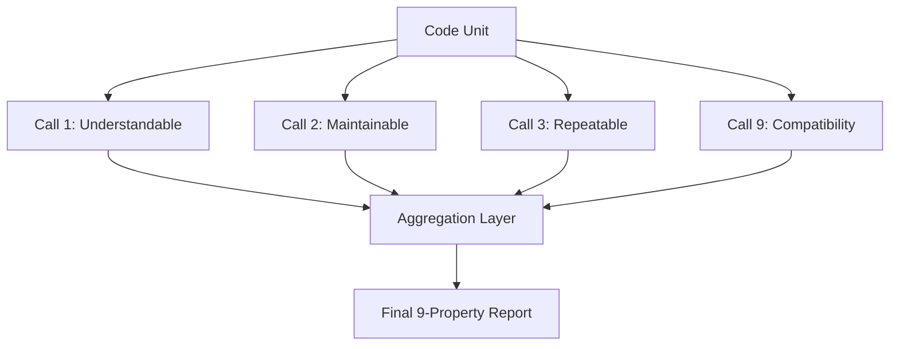
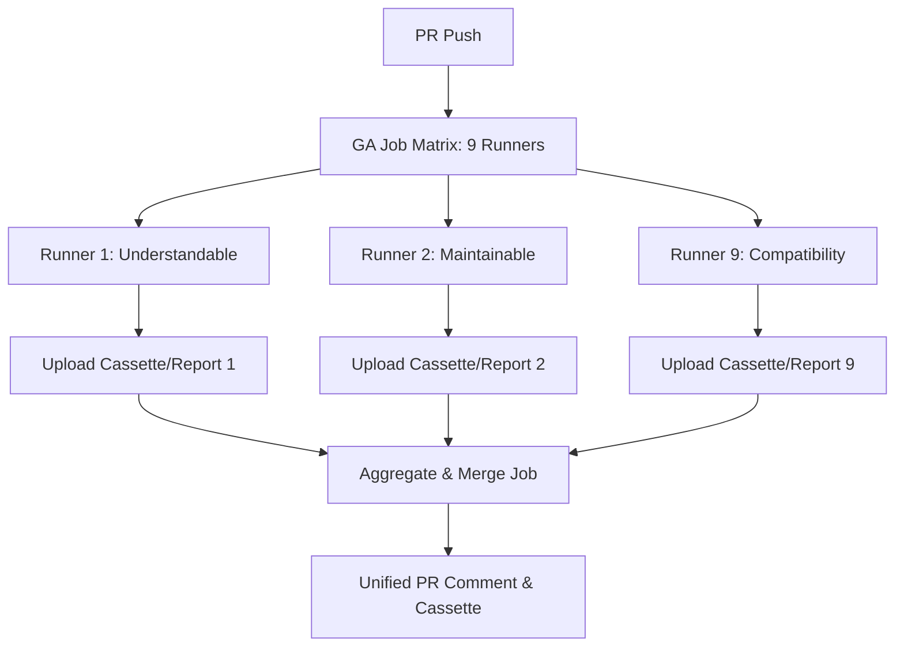

# Proposal: Prompt Engineering Architecture Upgrade

This document outlines a proposal to restructure and improve the LLM prompt architecture within our CI/CD code quality pipelines (specifically the **Code Review Evaluator** and **Farley Test Evaluator**). It integrates Anthropic's **Anatomy of a Claude Prompt** design patterns and proposes a 9th Farley evaluation dimension: **Compatibility**.

---

## 1. Key Shortcomings of the Current Prompting Model

Our current prompting model (implemented in `farley_score_evaluator.py` and `code_review_evaluator.py`) is structured as a **single-turn, monolithic query**. It requests a Pydantic-structured evaluation of 6 to 8 complex, independent properties simultaneously.

### A. Attention and Nuance Dilution (The "Monolithic" Problem)
When an LLM is asked to critique code on Readability, Maintainability, Correctness, Complexity, Security, and Test Coverage all at once:
* The model's context attention is spread thin.
* Nuanced, edge-case bugs (e.g., resource leaks, platform compatibility issues) are often overlooked because the model spends most of its generation/thinking budget summarizing general quality or readability.

### B. Missing Claude Prompt Best Practices
Our current system prompts lack structural anchors. To maximize reasoning and output quality (especially with modern Claude or Gemini models), we should adopt:
* **XML wrapping** for file contents, context, and schemas.
* **Separated reasoning (`<thinking>` tags)** before generating the final JSON response.
* **Clear example pairs** to seed what a "good" vs. "critical" review looks like.

### C. The Blind Spot: Platform Compatibility
Our current evaluations failed to flag compatibility issues (such as hardcoded path separators `\` or `/` that fail when transitioning between Windows CI agents and macOS local development). We need a dedicated evaluation dimension to catch OS, environment, and library compatibility bugs.

---

## 2. Introducing the 9th Farley Dimension: Compatibility

We propose adding **Compatibility** as the 9th metric in the Farley Test Evaluator (and a parallel check in the Code Review Evaluator). 

### Definition
A test or code unit is **Compatible** if it executes reliably across different operating systems (Windows, macOS, Linux), hardware architectures, and runtime environments without local machine state side effects.

### Critical Checks for the Compatibility Metric
1. **OS File Path Handling**: Use of `Path` objects (`pathlib`) instead of hardcoded string splits or platform-specific separators (`/` or `\`).
2. **Environment Dependency**: Relying on machine-specific binaries, OS tools, or global environment variables without fallback.
3. **Line Endings & Encoding**: Hardcoding `\n` or `\r\n` expectations instead of platform-neutral templates, or opening files without specifying `encoding="utf-8"`.
4. **Shell Execution**: Running raw shell scripts (`/bin/sh` or `zsh` commands) that fail on Windows runners, instead of platform-agnostic Python equivalents.

---

## 3. Applying the "Anatomy of a Claude Prompt"

To align with Anthropic's recommended structure, each prompt should follow an 8-block blueprint:

```
┌──────────────────────────────────────────────────────────┐
│ 1. ROLE                                                  │
│ "You are an elite, critical Software Quality Coach..."   │
├──────────────────────────────────────────────────────────┤
│ 2. TASK                                                  │
│ "Analyze the code inside <source_code> for [metric]..."  │
├──────────────────────────────────────────────────────────┤
│ 3. CONTEXT                                               │
│ XML-tagged payload containing file path, metadata, etc.  │
├──────────────────────────────────────────────────────────┤
│ 4. EXAMPLES                                              │
│ XML-tagged <examples> of weak vs. strong reviews         │
├──────────────────────────────────────────────────────────┤
│ 5. THINKING                                              │
│ Mandatory `<thinking>` block before emitting the JSON    │
├──────────────────────────────────────────────────────────┤
│ 6. CONSTRAINTS                                           │
│ "Never output conversational filler. Only write JSON..." │
├──────────────────────────────────────────────────────────┤
│ 7. OUTPUT FORMAT                                         │
│ Exact Pydantic JSON schema specification                 │
├──────────────────────────────────────────────────────────┤
│ 8. PREFILL (API only)                                    │
│ "{" (Force direct JSON generation)                       │
└──────────────────────────────────────────────────────────┘
```

---

## 4. Multi-Call vs. Monolithic Prompting (Architectural Options)

To prevent details from being missed, we have two primary architectural paths:

### Option A: Monolithic with Multi-Step Thinking (Recommended First Step)
We keep a single LLM call per unit but restructure the prompt to force the LLM to think through **each metric sequentially** inside `<thinking>` tags before emitting the final Pydantic block.

* **Pros**: Cost-effective (1 LLM call per unit), fast execution.
* **Cons**: The final output is still limited by the model's single-turn reasoning window.

### Option B: Modular Multi-Call Architecture
We execute **9 parallel LLM calls** (one for each Farley property) per code unit. Each call uses a specialized prompt template focused 100% on that single property.



* **Pros**: 
  * Near-zero chance of missing details; the model's entire attention is focused on one concern at a time.
  * We can supply rich, metric-specific instruction templates and examples.
* **Cons**:
  * 9x increase in LLM calls (higher token spend, potential API rate-limit bottlenecks).
  * Slower completion times if run sequentially or on a single CPU.

### Option C: CI-Distributed Job Matrix (Parallel Runners)
Instead of running all 9 properties in a single job execution, we use a GitHub Actions **Build Matrix** to distribute evaluation. We spawn 9 parallel runner instances (one for each property). 



* **Pros**:
  * **Free Concurrency**: Leverages GitHub's parallel runners (virtual machines) to run model inference in parallel across separate CPU clusters.
  * **Zero Cloud Costs**: Uses the local Qwen model running in a sidecar container on each VM runner, incurring $0 in external API costs.
  * **Fault Isolation**: If one evaluation fails or runs slowly, it does not block or crash the other properties.
* **Cons**:
  * **Startup Overhead**: Each of the 9 jobs must spin up, install python dependencies, and pull the Qwen model file (~1.2GB). This adds ~1-2 minutes of flat setup latency per run.
  * **Complexity**: Requires writing a cassette-merging script that runs in the final aggregation job to merge the separate properties into one combined report.

---

## 5. Environmental Analysis: Local CPU vs. Hosted APIs vs. CI-Distributed Matrix

The choice between **Option A (Monolithic)**, **Option B (Modular Multi-Call)**, and **Option C (CI-Distributed Matrix)** depends on the execution environment.

### A. Local CPU Execution (Local Machine / Single Threaded Ollama)
When a developer runs evaluations on their own computer before committing:
* **The Concurrency Bottleneck**: Ollama running locally on CPU evaluates sequentially. Running 9 separate properties per unit takes 9x longer, creating excessive waiting times.
* **Best Choice**: **Option A (Monolithic)**. Keep the prompts inside a single call to preserve developer workflow velocity.

### B. Hosted APIs (Nebius, Together, Groq, DeepSeek)
When cloud GPUs are accessible:
* **Parallel Cloud Scaling**: Concurrency is handled instantly by the provider's API. 9 concurrent calls finish in parallel in <3 seconds.
* **Best Choice**: **Option B (Modular Multi-Call)**. Gives the highest quality, focused review at minimal cost (fractions of a cent).

### C. CI Execution on Free Runners (GitHub Actions + Ollama Sidecar)
When executing inside a PR validation workflow:
* **Distributed VM Scaling**: By defining a matrix of 9 properties, GitHub spins up **9 separate runners** concurrently. Each runner executes its own local Qwen/Ollama container.
* **Eliminating Latency**: The sequential CPU queue bottleneck is eliminated because the 9 CPU inferences occur on 9 physically distinct virtual machines.
* **Best Choice**: **Option C (CI-Distributed Job Matrix)**. Gives the deep-dive benefits of modular prompts (Option B) and the free cost of local models, without the sequential execution penalty.

### Recommendation Grid

| Metric / Need | Local Developer Machine | CI Runner (Local Model) | CI Runner (Cloud API) |
| :--- | :--- | :--- | :--- |
| **Primary Choice** | **Option A (Monolithic)** | **Option C (CI Matrix)** | **Option B (Modular Multi-Call)** |
| **Execution Latency** | Low (~10-15s per unit) | Medium (~2m startup + 10s run) | Ultra-Low (~3s total) |
| **Inference Cost** | $0 | $0 | Low (<$0.01 per run) |
| **Attention Focus** | Distributed (Monolithic) | Highly Focused (Modular) | Highly Focused (Modular) |
| **Complexity** | Low | High (Requires merging artifacts) | Medium |

---

## 6. Implementation Roadmap Proposal

When we are ready to implement, we should:

1. **Extend Schemas**:
   * Add `compatibility: PropertyEvaluation` to `FarleyScoreBreakdown` and `CodeReviewBreakdown`.
2. **Refactor prompt structure**:
   * Integrate XML tag structures and `<thinking>` directives into the evaluator prompts.
3. **Implement Concurrency-Friendly Multi-Calling (If Option B is chosen)**:
   * Write a generator that executes property-specific checks concurrently using `asyncio.gather`.
   * Cache responses using `agentbeats.replay` so we don't repeat calls during local testing.
