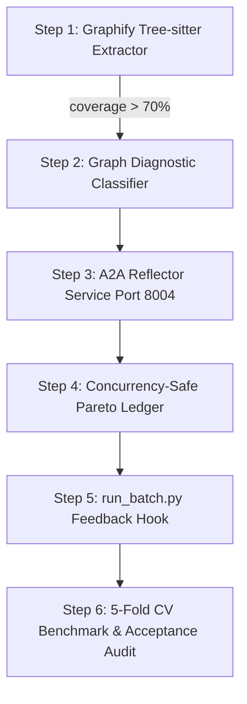

# Specification: Graph-Powered GEPA Pareto Prompt Reflector (v1.0.0)

- **Document ID:** `SPEC_GEPA_GRAPH_PARETO_REFLECTOR_V1`
- **Date:** August 2026
- **Status:** Draft / Proposed Specification
- **Target Implementation:**
  - `scenarios/debate/reflector_agent.py` (A2A Reflector Service on Port `8004`)
  - `scenarios/debate/graphify_flow_extractor.py` (Tree-sitter AST & Graphify Flow Extractor)
  - `scenarios/debate/graph_dataflow.py` (Stage B Graph Reachability & Proof Evaluator)
  - `scenarios/debate/run_batch.py` (Debate Harness Integration & Feedback Hook)
  - `scripts/evaluate_graphify_cv.py` (5-Fold Stratified Scenario-Grouped CV Benchmark)
  - `artifacts/gepa/` (Concurrency-Safe Pareto Frontier & Mutation History)
- **Primary References:**
  - [MULTIAGENT_VULNERABILITY_SWARM_HYPOTHESES.md](MULTIAGENT_VULNERABILITY_SWARM_HYPOTHESES.md) (Swarm Hypotheses, 4 Anti-Gaming Invariants, Diagnostic Buckets)
  - [GEPA_PROPOSAL_BARRED_OPTIMIZATION.md](GEPA_PROPOSAL_BARRED_OPTIMIZATION.md) (Genetic-Pareto Prompt Adaptation Proposal)
  - [RFC_GRAPH_DATAFLOW_PRE_FILTER.md](RFC_GRAPH_DATAFLOW_PRE_FILTER.md) (Semantic Data-Flow Reachability Architecture)
  - [RFC_PRE_FILTER_STRATIFIED_CV.md](RFC_PRE_FILTER_STRATIFIED_CV.md) (Scenario-Grouped Stratified CV Protocol)
  - `Graphify` (`scratch/graphify/`) (Tree-Sitter Extractors, Community Clustering, `reflect.py` Work Memory)
  - `Graphiti` (`scratch/graphiti/`) (Bi-Temporal Edge Invalidation & Episodic Graph Topology)

---

## 1. Executive Summary & Problem Definition

### 1.1 The Unstructured Feedback Problem in Standard GEPA
The [GEPA Proposal](GEPA_PROPOSAL_BARRED_OPTIMIZATION.md) (based on Agrawal et al., ICLR 2026) replaces scalar-reward RL with natural language reflection over execution traces $\mu_f = \{\text{reject\_reason}, \text{pro\_arg}, \text{con\_arg}, \text{judge\_adjudication}, \text{verifier\_report}\}$. However, passing thousands of tokens of raw, unstructured debate text directly to a Reflection LLM introduces three critical failure modes identified in [MULTIAGENT_VULNERABILITY_SWARM_HYPOTHESES.md](MULTIAGENT_VULNERABILITY_SWARM_HYPOTHESES.md):

1. **Diagnostic Hallucination (Miscalibrated Credulity):** The Reflector LLM frequently misdiagnoses the true root cause of code rejection, generating prompt mutations that address superficial wording rather than semantic data-flow defects.
2. **Conformity & Unproductive Refinement Loops:** Without structural guidance, debaters in Attempt 2+ repeat identical syntactic variations of flawed code, failing the $\text{refinement\_correction\_success\_rate} \ge 0.30$ requirement.
3. **Parser Coverage Bottleneck:** In our baseline 5-fold CV evaluation, Stage B Graph Data-Flow achieved perfect precision ($\text{FP} = 0$), but was bottlenecked by a **14.81% AST parser coverage** (138/162 samples falling into `unsupported_syntax`).

### 1.2 The Graph-Powered GEPA Solution
This specification establishes a **Graph-Powered GEPA Reflector**:
- **Graphify Tree-sitter C Extraction:** Replaces narrow regex parsing with robust Tree-sitter C grammar AST extraction, elevating parser coverage from **$14.8\%$ to $>70\%$** without failing closed on partial snippets.
- **Structured Topological Feedback ($\mu_f^{\text{graph}}$):** Replaces ambiguous text with deterministic graph diagnostic signatures: `(failure_bucket, source_id, sink_id, sink_type, required_sanitizer, found_sanitizer, target_var, guarded_target, failed_anchor_lines)`.
- **Deterministic Work Memory Reflection:** Integrates Graphify's `reflect.py` time-decay scoring model to maintain a ledger of preferred vs. dead-end arguments grouped by vulnerability community.
- **Topology-Indexed Pareto Registry:** Indexes Pareto prompt variants by **Canonical Vulnerability Key $(S, P, K)$** across four vulnerability taxonomies, ensuring optimal specialist prompts are dispatched per vulnerability class.

---

## 2. System Architecture & End-to-End Pipeline

```text
 ┌──────────────────────────────────────────────────────────────────────────────────┐
 │                        BARRED Multiagent Debate Execution                        │
 │                                                                                  │
 │  [Pro Generator] ──► [Con Debater] ──► [Judge] ──► [Verifier Audit]              │
 └────────────────────────────────────────┬─────────────────────────────────────────┘
                                          │
                                          │ Attempt Failed Audit (μ_f)
                                          ▼
 ┌──────────────────────────────────────────────────────────────────────────────────┐
 │               Graphify Tree-sitter + Graphiti Data-Flow Extractor                │
 │                                                                                  │
 │  • Extracts FlowGraphSnapshot (Source ──► Transform ──► Sanitizer ──► Sink)      │
 │  • Evaluates evaluate_graph_reachability() deterministically                     │
 │  • Classifies Graph Failure Bucket by strict priority ranking                    │
 │  • Verifies strict anchor lines (b2_anchor_match, b2_strict_fail)                │
 └────────────────────────────────────────┬─────────────────────────────────────────┘
                                          │
                                          │ Structured Graph Diagnostic Signature (μ_f^graph)
                                          ▼
 ┌──────────────────────────────────────────────────────────────────────────────────┐
 │                 ReflectorAgent Service (Port 8004 / FastAPI)                     │
 │                                                                                  │
 │  1. Work-Memory Reflection (Graphify reflect.py Engine):                         │
 │     - Checks historical lessons for Taxonomy Community (S, P, K)                 │
 │     - Identifies dead-end argument patterns and proven repairs                   │
 │                                                                                  │
 │  2. Graph-Conditioned Targeted Prompt Mutation:                                  │
 │     - Injects exact topological constraint into Debater/Generator Prompts        │
 │       (e.g., "Anchor BOUNDS_CHECK on variable 'len' before sink 'memcpy'")       │
 │                                                                                  │
 │  3. Concurrency-Safe Pareto Frontier Update:                                     │
 │     - Atomically updates artifacts/gepa/pareto_frontier.json via shared lock     │
 │     - Appends trace to artifacts/gepa/mutations.jsonl                            │
 └────────────────────────────────────────┬─────────────────────────────────────────┘
                                          │
                                          │ Mutated Pareto Specialist Prompt
                                          ▼
 ┌──────────────────────────────────────────────────────────────────────────────────┐
 │                  Next Refinement Loop / Seed Attempt (Attempt 2+)                 │
 └──────────────────────────────────────────────────────────────────────────────────┘
```

---

## 3. Data Contracts & Structured Schemas

### 3.1 Closed-Set Taxonomy & Failure Bucket Type Aliases

```python
from typing import Any, Callable, Dict, List, Literal, Optional
from pydantic import BaseModel, Field

FailureBucket = Literal[
    "B_UNSUPPORTED_SYNTAX",
    "B_LOGIC_ERROR",
    "B_ANCHOR_UNMATCHED",
    "B_SOURCE_MISSING",
    "B_SINK_MISSING",
    "B_SANITIZER_MISMATCH",
    "B_SANITIZER_TARGET_MISMATCH",
]

TaxonomyBucket = Literal[
    "memory_safety",
    "integer_arithmetic",
    "concurrency",
    "input_validation",
]
```

### 3.2 Graph Failure Bucket Taxonomy & Deterministic Precedence
When a candidate attempt fails adjudication, it is classified into **exactly one** diagnostic bucket using the following strict, top-to-bottom precedence order:

| Precedence | Bucket ID | Diagnostic Trigger Condition | Reflector Prompt Action |
| :--- | :--- | :--- | :--- |
| **1 (Highest)** | `B_UNSUPPORTED_SYNTAX` | Tree-sitter parsing is incomplete and no AST nodes are recovered (`is_complete == False` and `len(nodes) == 0`). | Fallback to sanitized baseline prompt with macro expansion / standard C snippet guidance. |
| **2** | `B_LOGIC_ERROR` | Verifier detected factual contradiction or self-inconsistent proof chain (`verifier_logic_error == True`). | Suppress flawed argument; prompt Con debater with contradiction counter-evidence. |
| **3** | `B_ANCHOR_UNMATCHED` | Candidate code lines fail case-insensitive substring match against source repo (`b2_strict_fail == True` or `b2_anchor_match == False`). | Instruct Pro to quote exact line anchors directly from repository context. |
| **4** | `B_SOURCE_MISSING` | AST contains sink operation, but source parameter is untracked/synthetic (`source_type == "UNKNOWN_ORIGIN"` or missing parameter). | Instruct Pro to ground untrusted input to genuine function entrypoint parameters. |
| **5** | `B_SINK_MISSING` | Predicate claims vulnerability, but AST contains no matching sink operation (`len(signatures) == 0` or missing call/subscript). | Instruct Pro to synthesize the concrete vulnerable operation (`memcpy`, subscript, etc.). |
| **6** | `B_SANITIZER_MISMATCH` | Reachable sink exists, but sanitizer type does not match sink requirements (e.g. `NULL_CHECK` on `ARRAY_INDEX` or missing bounds). | Instruct Pro to generate `BOUNDS_CHECK` or `RANGE_VALIDATION` targeting `target_var`. |
| **7 (Lowest)** | `B_SANITIZER_TARGET_MISMATCH` | Valid sanitizer type exists, but guards `var_a` while sink dereferences `var_b` (`guarded_target != target_var`). | Instruct Pro to align sanitizer guard variable with sink operand `target_var`. |

---

### 3.3 Canonical Graph Diagnostic Schema (`μ_f^graph`)

```python
class GraphDiagnosticSignature(BaseModel):
    """
    Standardized graph diagnostic feedback emitted by the AST extraction layer.
    Reconciles FlowSignature fields with upstream debate audit telemetry.
    """
    scenario_id: str = Field(..., description="Scenario ID or HASH-{sha256[:10]}")
    predicate_family: str = Field(..., description="e.g. BUFFER_OVERFLOW, USE_AFTER_FREE, COMMAND_INJECTION")
    failure_bucket: FailureBucket = Field(..., description="Canonical FailureBucket ID")
    source_id: Optional[str] = None
    sink_id: Optional[str] = None
    sink_type: Optional[str] = None
    required_sanitizer: Optional[str] = None
    found_sanitizer: Optional[str] = None
    target_var: Optional[str] = Field(None, description="Operand targeted by the sink operation")
    guarded_target: Optional[str] = Field(None, description="Operand protected by the sanitizer guard")
    failed_anchor_lines: List[str] = Field(default_factory=list)
    verifier_logic_error: bool = False
    verifier_report: Dict[str, Any] = Field(default_factory=dict)
    judge_rationale: str = ""

    def to_flow_dict(self) -> Dict[str, Any]:
        """Adapter for backward compatibility with FlowSignature dict schemas."""
        return {
            "source_id": self.source_id,
            "sink_id": self.sink_id,
            "sink_type": self.sink_type,
            "sanitizer_type": self.found_sanitizer,
            "target_var": self.target_var,
            "guarded_target": self.guarded_target,
            "failure_bucket": self.failure_bucket,
            "invalid_at": self.failed_anchor_lines,
        }
```

---

### 3.4 A2A Reflector API Schema (HTTP Port 8004) & Structured-Output Fallback

All prompt mutation requests are executed via `call_structured(...)` from `agentbeats.structured_output`:

```python
class ReflectRequest(BaseModel):
    attempt_index: int = Field(..., ge=1, description="Current attempt number for this seed")
    scenario_id: str
    predicate_family: str
    taxonomy_bucket: TaxonomyBucket
    code_text: str
    graph_diagnostic: GraphDiagnosticSignature
    current_system_prompt: str
    raw_execution_trace: Optional[Dict[str, Any]] = None

class ReflectResponse(BaseModel):
    status: Literal["SUCCESS", "FALLBACK_BASELINE", "NO_MUTATION_NEEDED"]
    mutated_system_prompt: str = Field(..., min_length=1, description="Must be non-empty valid prompt")
    mutation_rationale: str
    applied_topological_rule: str
    taxonomy_bucket: TaxonomyBucket
    pareto_variant_id: str = Field(..., min_length=1, description="Canonical mutation identifier")
    estimated_correction_success_probability: float = Field(..., ge=0.0, le=1.0)
```

#### Status-Specific Prompt Handling Invariants:
1. **`SUCCESS`:** `mutated_system_prompt` contains the verified, topologically-constrained prompt variant for the next attempt, and `pareto_variant_id` contains the applied mutation rule hash.
2. **`FALLBACK_BASELINE`:** When the Reflector LLM output is unrecoverable, schema repairs fail, or a taxonomy bucket mismatch occurs, the Reflector sets `status="FALLBACK_BASELINE"`, `pareto_variant_id="baseline_v0"`, and populates `mutated_system_prompt` with the static baseline specialist prompt.
3. **`NO_MUTATION_NEEDED`:** When the failure was non-prompt-related (e.g. transient timeout), `status="NO_MUTATION_NEEDED"` preserves the current prompt and mutation identifier without attributing to an unverified Pareto variant.

---

## 4. Deterministic Work-Memory & Reflection Engine

Following Graphiti's bi-temporal tracking and Graphify's `reflect.py` architecture, the Reflector maintains an experiential work-memory without relying on ungrounded LLM memory.

### 4.1 Time-Decayed Lesson Scoring Algorithm
Every evaluated attempt emits an immutable ledger record containing:
- `scenario_id`: Unique identifier of the test scenario ($S$).
- `seed_id`: Specific benchmark random seed.
- `predicate_family`: Security predicate family ($P$).
- `taxonomy_bucket`: Structural vulnerability domain ($K$).
- `attempt_index`: Attempt number ($1 \le \text{attempt} \le \text{max\_attempts}$).
- `observed_at`: Injected epoch timestamp of initial attempt execution.
- `evaluated_at`: Injected epoch timestamp of outcome evaluation.
- `outcome`: One of `VALID_ACCEPT`, `LOGIC_ERROR`, `DEAD_END_CHAIN`, or `RETRYABLE_FAILURE`.
- `canonical_mutation_id`: Stable hash of the applied prompt mutation rule (or `"baseline_v0"` when unmutated).

Each historical attempt record $i$ for a given vulnerability family $(S, P, K)$ contributes a signed, time-decayed score $s_i$:

$$S(n) = \sum_{i \in \text{Traces}(n)} \text{Sign}(\text{Outcome}_i) \cdot 2^{-\frac{\Delta t_i}{\tau_{\text{half\_life}}}}$$

Where:
- $\text{Sign}(\text{Outcome}_i) = +1.0$ if $\text{Outcome} == \texttt{VALID\_ACCEPT}$
- $\text{Sign}(\text{Outcome}_i) = -1.5$ if $\text{Outcome} \in \{\texttt{LOGIC\_ERROR}, \texttt{DEAD\_END\_CHAIN}\}$ (penalized heavily)
- $\text{Sign}(\text{Outcome}_i) = -0.5$ if $\text{Outcome} == \texttt{RETRYABLE\_FAILURE}$
- $\tau_{\text{half\_life}} = 30.0\text{ days}$ (ensures recent failures immediately outweigh older successes)
- **Promotion Threshold:** A prompt mutation rule is marked `PREFERRED` only when corroborated by $\ge 2$ distinct successful seeds ($\text{Corroboration} \ge 2$).

### 4.2 Cross-Seed Dead-End Suppression
If a specific prompt mutation or argument transformation identity has failed $\ge 3$ consecutive attempts across distinct seeds with zero recoveries, the Reflector automatically stamps it as a `KNOWN_DEAD_END` in `artifacts/gepa/lessons.json` and injects an explicit negative constraint (e.g., *"Do not propose pointer null-check as a fix for buffer index overflow"*).

The atomic outcome recording operation evaluates the current failed attempt together with prior cross-seed history before assigning the outcome. If the current failure completes $\ge 3$ consecutive cross-seed failures with zero recoveries, it is immediately classified as `DEAD_END_CHAIN` on that attempt.

---

## 5. Taxonomy-Indexed Pareto Frontier Registry

### 5.1 Vulnerability Taxonomy Buckets
GEPA maintains distinct Pareto-optimal prompt pools across four structural vulnerability domains:

1. `memory_safety`: Pointer arithmetic, buffer overflow, use-after-free, double free, off-by-one writes.
2. `integer_arithmetic`: Integer overflow, unsigned wrap-around, width truncation, signedness comparison bugs.
3. `concurrency`: TOCTOU race conditions, lock-free invariants, double-checked locking, deadlocks.
4. `input_validation`: Command injection, path traversal, untrusted deserialization, format string bugs.

### 5.2 Shared Concurrency Lock & Lessons Contract
To support multi-threaded batch runs (`run_batch.py` with concurrency $C=4$):

1. **Unified Global GEPA Lock:** All reads and updates to `artifacts/gepa/pareto_frontier.json`, `artifacts/gepa/lessons.json`, and appends to `artifacts/gepa/mutations.jsonl` must acquire a single shared serialization lock on `artifacts/gepa/gepa_ledger.lock` using non-blocking `fcntl.flock(fd, fcntl.LOCK_EX | fcntl.LOCK_NB)` with exponential backoff retry ($t \in [10\text{ms}, 500\text{ms}]$, max timeout $5.0\text{s}$).
2. **Atomic Write Publication:** Writes to `pareto_frontier.json` and `lessons.json` are staged to temporary files (`pareto_frontier.json.tmp.<pid>.<uuid>`, `lessons.json.tmp.<pid>.<uuid>`) and published via `os.replace` while holding the shared lock.
3. **Append-Only Serialized Audit Log:** Every mutation event is logged unconditionally to `artifacts/gepa/mutations.jsonl` while holding the shared lock.

---

## 6. Execution Lifecycle in `run_batch.py`

```python
from dataclasses import dataclass
import logging
import time
from typing import Any, Callable, Dict, Optional
from agentbeats.replay import OfflineReplayError, ReplayManager
from scenarios.debate.graphify_flow_extractor import extract_graphify_flow_snapshot
from scenarios.debate.graph_dataflow import evaluate_graph_reachability

logger = logging.getLogger("run_batch")

@dataclass(frozen=True)
class AttemptResult:
    status: str  # "ACCEPTED" or "REJECTED"
    attempts_used: int
    last_debate_result: Any
    final_risk_score: float
    rejection_reason: Optional[str] = None

async def execute_seed_with_graph_gepa(
    scenario_record: Dict[str, Any],
    max_attempts: int = 3,
    reflector_client: Optional[ReflectorClient] = None,
    replay_manager: Optional[ReplayManager] = None,
    clock_fn: Optional[Callable[[], float]] = None,
) -> AttemptResult:
    """
    Executes a multiagent debate with Graph-Powered GEPA prompt adaptation.
    Guarantees typed return, cassette replay stability, and explicit failure states across all paths.
    """
    if max_attempts < 1:
        raise ValueError(f"max_attempts must be >= 1, got {max_attempts}")

    now_fn = clock_fn if clock_fn is not None else time.time
    
    # Require canonical scenario identity without silent fallback placeholders
    predicate = scenario_record["predicate"]
    taxonomy = classify_taxonomy_bucket(predicate)
    predicate_family = scenario_record.get("predicate_family") or predicate.split(":")[0].strip()
    
    raw_seed_id = scenario_record.get("seed_id")
    if raw_seed_id is None:
        if "seed" not in scenario_record:
            raise ValueError("scenario_record requires seed_id or seed")
        raw_seed_id = scenario_record["seed"]
    seed_id = str(raw_seed_id)
    if not seed_id:
        raise ValueError("seed_id must be non-empty")
    
    # Retrieve initial prompt (with baseline fallback if reflector_client is None)
    if reflector_client is not None:
        current_prompt = await reflector_client.get_pareto_prompt(taxonomy)
    else:
        current_prompt = get_static_baseline_prompt(taxonomy)

    last_debate_result = None
    last_risk_score = 1.0
    active_mutation_id = "baseline_v0"

    for attempt_idx in range(1, max_attempts + 1):
        observed_at = now_fn()

        # 1. Execute Multiagent Debate (Pro, Con, Judge, Verifier)
        debate_result = await run_single_debate_attempt(
            scenario=scenario_record,
            system_prompt=current_prompt,
            attempt_idx=attempt_idx,
            replay_manager=replay_manager,
        )
        last_debate_result = debate_result

        # 2. Extract Graph Snapshot via Tree-sitter & Evaluate Reachability
        graph_snapshot = extract_graphify_flow_snapshot(
            code_text=debate_result.candidate_code,
            scenario_id=scenario_record["scenario_id"],
        )
        risk_score = evaluate_graph_reachability(graph_snapshot)
        last_risk_score = risk_score

        # 3. Check Authoritative 3-Layer Adjudication Contract
        # Strict requirement: b2_anchor_match must be True AND b2_strict_fail must be False
        is_valid = (
            debate_result.verifier_verdict == "PASS"
            and debate_result.verifier_parse_ok is True
            and debate_result.verifier_logic_error is False
            and debate_result.b2_anchor_match is True
            and debate_result.b2_strict_fail is False
            and risk_score < 0.10
        )

        diag = classify_graph_diagnostic(debate_result, graph_snapshot, risk_score)

        evaluated_at = now_fn()

        # Record outcome and evaluate against prior cross-seed history
        if reflector_client is not None:
            outcome = await reflector_client.record_attempt_and_classify_outcome(
                taxonomy_bucket=taxonomy,
                predicate_family=predicate_family,
                seed_id=seed_id,
                scenario_id=scenario_record["scenario_id"],
                prompt=current_prompt,
                attempt_index=attempt_idx,
                is_valid=is_valid,
                verifier_logic_error=debate_result.verifier_logic_error,
                observed_at=observed_at,
                evaluated_at=evaluated_at,
                canonical_mutation_id=active_mutation_id,
            )
        else:
            if is_valid:
                outcome = "VALID_ACCEPT"
            elif debate_result.verifier_logic_error:
                outcome = "LOGIC_ERROR"
            else:
                outcome = "RETRYABLE_FAILURE"

        if is_valid:
            return AttemptResult(
                status="ACCEPTED",
                attempts_used=attempt_idx,
                last_debate_result=debate_result,
                final_risk_score=risk_score,
            )

        # 4. If failed and attempts remain: Mutate Prompt via Reflector
        if attempt_idx < max_attempts and reflector_client is not None:
            reflect_req = ReflectRequest(
                attempt_index=attempt_idx,
                scenario_id=scenario_record["scenario_id"],
                predicate_family=predicate_family,
                taxonomy_bucket=taxonomy,
                code_text=debate_result.candidate_code,
                graph_diagnostic=diag,
                current_system_prompt=current_prompt,
            )

            # Route through ReplayManager.cassette when replay mode is active
            if replay_manager is not None and replay_manager.cassette.mode == "replay":
                cached_data = replay_manager.cassette.get_response(
                    model="reflector_agent",
                    messages=[{"role": "user", "content": reflect_req.model_dump_json()}],
                    params={"seed_id": seed_id, "scenario_id": scenario_record["scenario_id"], "attempt_index": attempt_idx},
                )
                if cached_data is None:
                    raise OfflineReplayError(
                        f"Reflector replay cache miss on scenario {scenario_record['scenario_id']} attempt {attempt_idx}"
                    )
                reflect_resp = ReflectResponse.model_validate(cached_data)
            else:
                reflect_resp = await reflector_client.reflect(reflect_req)
                if replay_manager is not None and replay_manager.cassette.mode == "record":
                    replay_manager.cassette.save_response(
                        model="reflector_agent",
                        messages=[{"role": "user", "content": reflect_req.model_dump_json()}],
                        params={"seed_id": seed_id, "scenario_id": scenario_record["scenario_id"], "attempt_index": attempt_idx},
                        response=reflect_resp.model_dump(),
                    )

            # Explicitly validate taxonomy consistency; reject mismatches and route to fallback baseline
            if reflect_resp.taxonomy_bucket != taxonomy:
                logger.error(
                    "Reflector taxonomy mismatch on scenario %s: expected %s, got %s. Routing to fallback baseline.",
                    scenario_record["scenario_id"], taxonomy, reflect_resp.taxonomy_bucket
                )
                current_prompt = get_static_baseline_prompt(taxonomy)
                active_mutation_id = "baseline_v0"
            else:
                if reflect_resp.status == "SUCCESS":
                    current_prompt = reflect_resp.mutated_system_prompt
                    active_mutation_id = reflect_resp.pareto_variant_id
                elif reflect_resp.status == "FALLBACK_BASELINE":
                    current_prompt = get_static_baseline_prompt(taxonomy)
                    active_mutation_id = "baseline_v0"
                # NO_MUTATION_NEEDED retains current_prompt and active_mutation_id

    return AttemptResult(
        status="REJECTED",
        attempts_used=max_attempts,
        last_debate_result=last_debate_result,
        final_risk_score=last_risk_score,
        rejection_reason="Exceeded maximum refinement attempts without satisfying 3-layer adjudication",
    )
```

---

## 7. Statistical Protocol & Acceptance Verification

In accordance with [EVALUATION_DISCIPLINE_GUIDE.md](EVALUATION_DISCIPLINE_GUIDE.md) and [MULTIAGENT_VULNERABILITY_SWARM_HYPOTHESES.md](MULTIAGENT_VULNERABILITY_SWARM_HYPOTHESES.md):

### 7.1 Authoritative Acceptance Bounds (9 Simultaneous Invariants)
A candidate Graph-Powered GEPA implementation is approved for production merge if and only if all 9 conditions hold:

1. **Zero Logic Errors:** `accepted_logic_error_rate == 0.0` with $\ge 1$ accepted corpus row.
2. **Strict Anchor Grounding:** `b2_anchor_match_rate >= 0.80` and `b2_strict_fail_rate <= 0.20`.
3. **Verifier Parse Reliability:** `verifier_parse_ok_rate >= 0.95`.
4. **Leak-Proof Partition Audit:** Zero scenario-predicate overlap verified across all 5 folds via SHA-256 partition hashing.
5. **Token Efficiency Superiority ($H_{1,Y}$):** $\ge 25\%$ reduction in `tokens_per_valid_accept` against un-adapted debate baseline with Holm-adjusted $p < 0.05$ across the 5 canonical benchmark seeds (`42, 43, 44, 45, 46`).
6. **Duplicate Candidate Suppression:** `duplicate_valid_accept_rate <= 0.20`.
7. **Graph Pre-Filter Generalization ($H_{1,T}$):** Out-of-fold $\text{ROC-AUC} \ge 0.7000$ and $\text{PR-AUC} \ge 0.6000$ on clean near-deduplicated holdouts ($n=247$).
8. **Refinement Correction Uptake ($H_{1,C}$):** $\text{refinement\_correction\_success\_rate} \ge 0.30$.
9. **Diagnostic Triage Gain ($H_{1,C}$):** $\text{diagnostic\_triage\_efficiency\_gain} \ge 0.15$.

---

## 8. Implementation Roadmap & File Changes



1. **`scenarios/debate/graphify_flow_extractor.py`:** Implement Graphify's Tree-sitter C extraction engine with error-tolerant AST traversal.
2. **`scenarios/debate/reflector_agent.py`:** Implement FastAPI microservice with Pydantic contracts and Graphify `reflect.py` work-memory scoring.
3. **`scenarios/debate/pareto_registry.py`:** Implement unified shared `fcntl.flock` companion-lock protected Pareto and lessons storage in `artifacts/gepa/`.
4. **`scenarios/debate/run_batch.py`:** Add Attempt 2+ reflection hooks and `ReplayManager` record/replay integration.
5. **`scripts/evaluate_graphify_cv.py`:** 5-fold Stratified Scenario-Grouped CV evaluation script to generate authoritative JSON compliance receipts.
