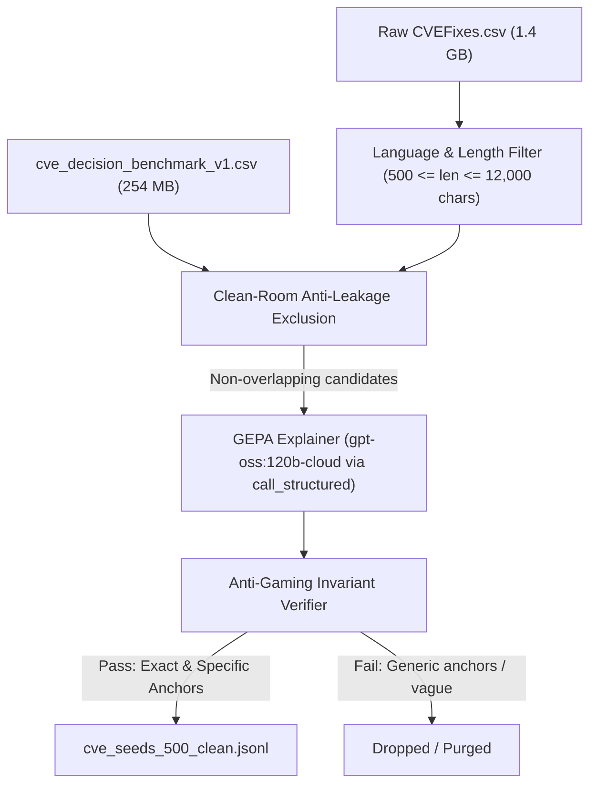

# GEPA-First Seed Generation: Technical Guide & Reproducibility

This document details the methodology, dataset sources, clean-room isolation, and reproducibility workflows for generating high-fidelity vulnerability seeds for the BARRED synthetic debate pipeline.

---

## 1. Personas & Workflows

To ensure seamless usability whether working inside a monorepo or cloning `silver-one` as a standalone repository, workflows are split by persona:

### Persona 1: Swarm Practitioner & Researcher (Default)
- **Objective:** Run multi-agent debates, test the B-gate verifier, train models, or benchmark pre-filters.
- **Data Access:** The Git repository includes a lightweight test fixture (`scenarios/debate/cve_seeds_test.jsonl`). The full 500 clean seeds dataset is published on **Hugging Face Hub** ([`surfiniaburger/cve-decision-seeds`](https://huggingface.co/datasets/surfiniaburger/cve-decision-seeds)).
- **Workflow:** Pull the clean seeds and run the debate batch:
  ```bash
  # Step 1: Download the 500 clean seeds (optional if already local)
  uv run python scripts/download_from_huggingface.py

  # Step 2: Run a batch using clean seeds
  uv run python scenarios/debate/run_batch.py \
    --seeds scenarios/debate/cve_seeds_500_clean.jsonl \
    --mode record
  ```

---

### Persona 2: Dataset Curator & Pipeline Engineer
- **Objective:** Ingest raw vulnerability corpora, execute anti-leakage exclusion, and expand the seed library using frontier models.
- **External Datasets Required:**
  1. **Source Vulnerability Corpus (1.4 GB):**  
     🔗 **[CVEFixes (Kaggle)](https://www.kaggle.com/datasets/girish17019/cvefixes-vulnerable-and-fixed-code)** (`CVEFixes.csv`)
  2. **Evaluation Benchmark & Exclusion Set (254 MB):**  
     🔗 **[CVE Decision Benchmark (Kaggle)](https://www.kaggle.com/datasets/surfiniaburger/cve-decision)** (`cve_decision_benchmark_v1.csv`)

- **Setup & Path Resolution:**
  Place the datasets in `kaggle_notebooks/`, or point to them via CLI arguments / environment variables:
  ```bash
  # Option A: Symlink / folder in workspace root
  mkdir -p kaggle_notebooks
  # Copy or symlink CVEFixes.csv and cve_decision_benchmark_v1.csv into kaggle_notebooks/

  # Option B: Run with explicit paths (e.g. from parent monorepo)
  uv run python scenarios/debate/cve_seed_loader.py \
    --source-csv ../../kaggle_notebooks/CVEFixes.csv \
    --eval-csv ../../kaggle_notebooks/cve_decision_benchmark_v1.csv \
    --existing-seeds scenarios/debate/cve_seeds_500_clean.jsonl \
    --target-total 500 \
    --output scenarios/debate/cve_seeds_500_clean.jsonl \
    --lang c \
    --mode record
  ```

---

## 2. Methodology: The GEPA-First Flow

Traditional synthetic data generation often starts with a generic prompt (*"Generate a C buffer overflow"*). Our approach, **GEPA-First (Generative Explanation of Program Anomalies)**, anchors directly in **ground-truth CVE reality**.



### Phase A: Clean-Room Selection & Anti-Leakage Partitioning
We protect evaluation benchmarks from data contamination by enforcing strict multi-tier deduplication against the 5,000-sample **`cve-decision`** held-out set:
1. **Exact Hash (SHA-256):** Rejects byte-for-byte identical snippets.
2. **Normalized Hash:** Rejects code differing only in whitespace, comments, or indentation.
3. **Fuzzy 5-Gram Shingling:** Computes Jaccard similarity to reject near-duplicate structures ($J > 0.80$).

### Phase B: Structured Predicate Discovery (The GEPA Signal)
Raw CVE data only provides a binary *"Vulnerable/Safe"* label. We invoke a Frontier Teacher model using Pydantic structured output (`call_structured(GepaExplanation)`):
- **Falsifiable Predicate:** A concrete mechanism claim (e.g. *"The code is vulnerable to an out-of-bounds write in `jfs_open` when updating the active-file counter"*).
- **Evidence Hooks:** Verbatim syntax anchors extracted directly from the AST.
- **Proof Requirements:** Explicit conditions required by a skeptic to prove or falsify the claim.

---

## 3. Seed Dataset Schema

Each entry in `cve_seeds_500_clean.jsonl` conforms to the following schema:

```json
{
  "topic": "int func(int a) { ... }",
  "predicate": "The code is vulnerable to an out-of-bounds write in `func`...",
  "gepa_info": {
    "predicate": "The code is vulnerable to an out-of-bounds write in `func`...",
    "evidence_hooks": ["`func`", "`arr[idx]`"],
    "uncertainty": "Low",
    "proof_requirements": "Provide idx >= size"
  },
  "language": "c",
  "original_safety": "vulnerable",
  "anchors": ["func", "arr[idx]"]
}
```

### Schema Fields
- **`topic`** (`str`): Verbatim C source code snippet ($500 \le \text{length} \le 12,000$ characters).
- **`predicate`** (`str`): Primary falsifiable vulnerability/safety mechanism claim.
- **`gepa_info`** (`dict`): Structured model payload with explanation, hooks, and proof requirements.
- **`language`** (`str`): Target language (`c`, `cpp`).
- **`original_safety`** (`str`): Ground-truth baseline label (`vulnerable` or `safe`).
- **`anchors`** (`list[str]`): Verified, non-generic code identifiers used by the B-gate verifier to prevent hallucination.
